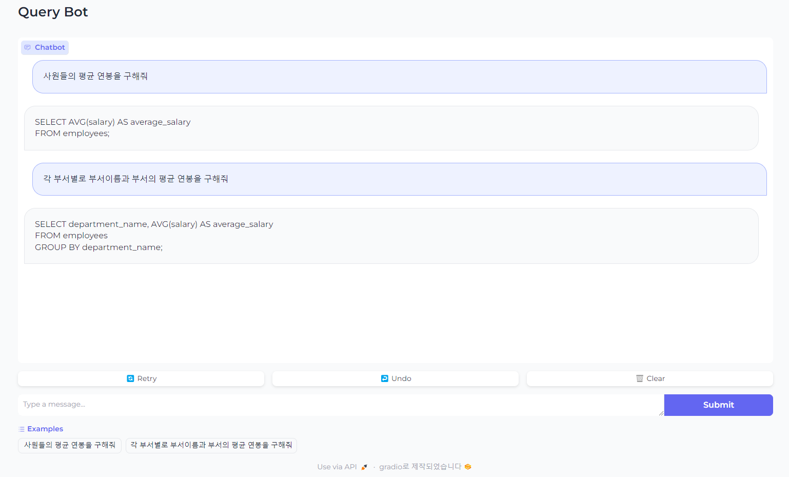

# LangChain

## 1. LangChain framework을 기반으로 OpenAPI API를 이용한 Chat UI 기능 구현

- Gradio나 Streamit 등을 이용하여 챗 화면 구성

- 이전 대화 맥락 유지하도록 prompt 구성

## 2. Hugging Face library 기반으로 sLLM 모델 기반 chat 기능 구현 및 학습


(참고1) [All About TinyLlama 1.1B - Analytics Vidhya](https://www.analyticsvidhya.com/blog/2024/01/tinyllama-b-size-doesnt-matter/)

(참고2) [SQL Generation in Text2SQL with TinyLlama's LLM Fine-tuning (analyticsvidhya.com)](https://www.analyticsvidhya.com/blog/2024/02/sql-generation-in-text2sql-with-tinyllamas-llm-fine-tuning/)


## 1. [LLM Chat Test](http://localhost:7860/)

```
# /app에서 main.py 실행
python .\main.py
```

### 목표: EMP, DEPT 테이블에서 적절한 Query를 생성하는 것

**✔️ 원하는 답변**

```
Q. 사원들의 평균 연봉을 구해줘

A. SELECT AVG(SAL) FROM EMP;

Q. 각 부서별로 부서이름과 부서의 평균 연봉을 구해줘

A. SELECT D.DNAME, AVG(E.SAL) 
     FROM EMP E
    INNER JOIN DEPT D
       ON E.DEPT_NO = D.DEPT_NO
    GROUP BY D.DNAME
```

### 1-1. RAG 사용하지 않고 순수 ChatOpenAI만 사용했을 때, 결과



**✔️ log 확인해보기**

```
prompt question : 사원들의 평균 연봉을 구해줘
prompt answer : SELECT AVG(salary) AS average_salary
FROM employees;
runtime: 0:00:01.646805 seconds

prompt question : 각 부서별로 부서이름과 부서의 평균 연봉을 구해줘
prompt answer : SELECT department_name, AVG(salary) AS average_salary
FROM employees
GROUP BY department_name;
runtime: 0:00:01.147693 seconds
```

- 일반적인 테이블 조회 쿼리는 작성하는 것을 확인 할 수 있다.
- 그러나, 원하는 테이블에서 조회하지는 못하는 것을 확인 할 수 있다.

### 1-2. RAG 사용하여 질의 해보기