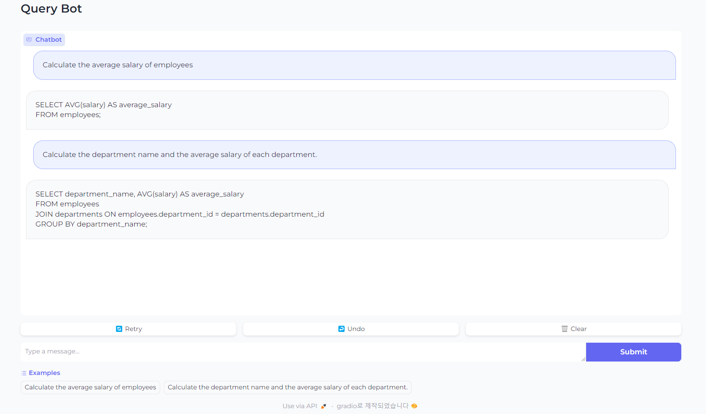
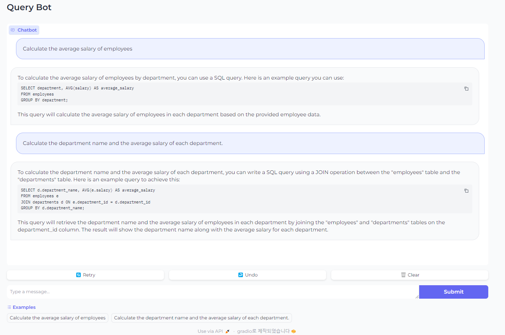
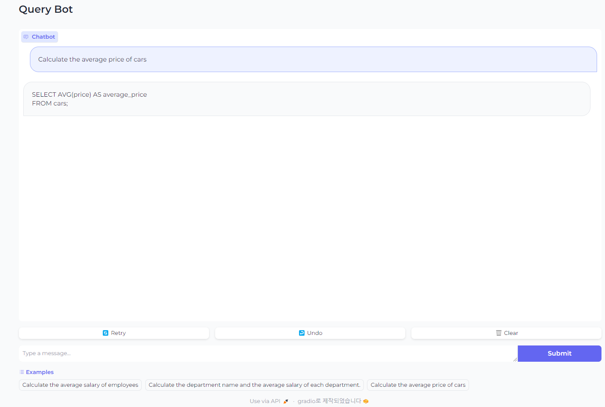
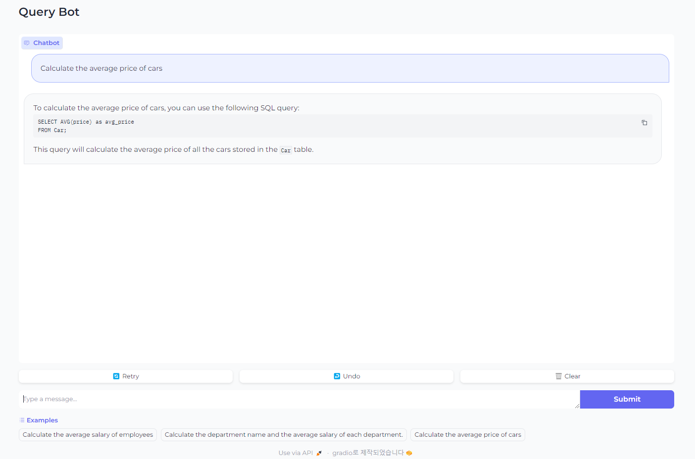

# LangChain

## 1. LangChain framework을 기반으로 OpenAPI API를 이용한 Chat UI 기능 구현

- Gradio나 Streamit 등을 이용하여 챗 화면 구성

- 이전 대화 맥락 유지하도록 prompt 구성

## 2. Hugging Face library 기반으로 sLLM 모델 기반 chat 기능 구현 및 학습


(참고1) [All About TinyLlama 1.1B - Analytics Vidhya](https://www.analyticsvidhya.com/blog/2024/01/tinyllama-b-size-doesnt-matter/)

(참고2) [SQL Generation in Text2SQL with TinyLlama's LLM Fine-tuning (analyticsvidhya.com)](https://www.analyticsvidhya.com/blog/2024/02/sql-generation-in-text2sql-with-tinyllamas-llm-fine-tuning/)


## 1. [LLM Chat Test](http://localhost:7860/)

```
# /app에서 main.py 실행
python .\main.py
```

### 목표: EMP, DEPT 테이블에서 적절한 Query를 생성하는 것

**✔️ 원하는 답변**

```
Q. 사원들의 평균 연봉을 구해줘

A. SELECT AVG(SAL) FROM EMP;

Q. 각 부서별로 부서이름과 부서의 평균 연봉을 구해줘

A. SELECT D.DNAME, AVG(E.SAL) 
     FROM EMP E
    INNER JOIN DEPT D
       ON E.DEPT_NO = D.DEPT_NO
    GROUP BY D.DNAME
```

### 1-1. RAG 사용하지 않고 순수 ChatOpenAI만 사용했을 때, 결과



**✔️ log 확인해보기**

```
prompt question : Calculate the average salary of employees
prompt answer : SELECT AVG(salary) AS average_salary
FROM employees;
runtime: 0:00:00.429590 seconds

prompt question : Calculate the department name and the average salary of each department.
prompt answer : SELECT department_name, AVG(salary) AS average_salary
FROM employees
JOIN departments ON employees.department_id = departments.department_id
GROUP BY department_name;
runtime: 0:00:01.320802 seconds
```

- 일반적인 테이블 조회 쿼리는 작성하는 것을 확인 할 수 있다.
- 그러나, 원하는 테이블에서 조회하지는 못하는 것을 확인 할 수 있다.

### 1-2. RAG 사용하여 질의 해보기

resources/docs에 RAG를 통해 질의할 시 참고하기 위한 테이블과 컬럼들의 정보가 담겨있는 파일들을 세팅 

```
./app/resources/docs

1. car.txt
2. dept.txt
3. emp_dep_relationship.txt
4. emp.txt
5. fruit.txt
```

각 테이블에 대한 설명은 ChatGPT를 기반으로 문서를 생성하였으며, 해당 텍스트 파일들을 통해 필요한 문서를 참고하여 답변을 생성



**✔️ log 확인해보기**

```
prompt question : Calculate the average salary of employees
directory : D:\github(didim365)\LangChain\app\./resources/docs, file list : ['car.txt', 'dept.txt', 'emp.txt', 'emp_dep_relationship.txt', 'fruit.txt']

retriever : tags=['Chroma', 'OpenAIEmbeddings'] vectorstore=<langchain_community.vectorstores.chroma.Chroma object at 0x0000027BB601C450> search_kwargs={'k': 3}

prompt message : 
    Let's think step by step. 
    1. Find the most suitable retriever for writing the query based on the user's requirements. 
    2. Write a query for the answer by reading the user's question, involving one or more tables. 
       The user's question is stated below.
       Query: Calculate the average salary of employees
       Answer:
    
source_documents : D:\github(didim365)\LangChain\app\resources\docs\emp_dep_relationship.txt
source_documents : D:\github(didim365)\LangChain\app\resources\docs\emp_dep_relationship.txt
source_documents : D:\github(didim365)\LangChain\app\resources\docs\emp_dep_relationship.txt

prompt answer : To calculate the average salary of employees by department, you can use a SQL query. Here is an example query you can use:

SELECT department, AVG(salary) AS average_salary
FROM employees
GROUP BY department;

This query will calculate the average salary of employees in each department based on the provided employee data.
runtime: 0:00:05.017926 seconds
```
```
prompt question : Calculate the department name and the average salary of each department.

directory : D:\github(didim365)\LangChain\app\./resources/docs, file list : ['car.txt', 'dept.txt', 'emp.txt', 'emp_dep_relationship.txt', 'fruit.txt']

retriever : tags=['Chroma', 'OpenAIEmbeddings'] vectorstore=<langchain_community.vectorstores.chroma.Chroma object at 0x0000027BB9C31110> search_kwargs={'k': 3}

prompt message : 
    Let's think step by step.
    1. Find the most suitable retriever for writing the query based on the user's requirements.
    2. Write a query for the answer by reading the user's question, involving one or more tables.
       The user's question is stated below.
       Query: Calculate the department name and the average salary of each department.
       Answer:

source_documents : D:\github(didim365)\LangChain\app\resources\docs\emp_dep_relationship.txt
source_documents : D:\github(didim365)\LangChain\app\resources\docs\emp_dep_relationship.txt
source_documents : D:\github(didim365)\LangChain\app\resources\docs\emp_dep_relationship.txt

prompt answer : To calculate the department name and the average salary of each department, you can write a SQL query using a JOIN operation between the "employees" table and the "departments" table. Here is an example query to achieve this:

SELECT d.department_name, AVG(e.salary) AS average_salary
FROM employees e
JOIN departments d ON e.department_id = d.department_id
GROUP BY d.department_name;

This query will retrieve the department name and the average salary of employees in each department by joining the "employees" and "departments" tables on the department_id column. The result will show the department name along with the average salary for each department.
runtime: 0:00:04.265327 seconds
```

- 일반적인 테이블 조회 쿼리는 작성하는 것을 확인 할 수 있다.
- 그러나, RAG 구성 없는 결과와 큰 차이가 없는 것을 확인 할 수 있다.

**✔️ 다른 테이블(Car)을 통해 실험해보기**

**1. ChatOpenAI 활용**



✔️ log 확인해보기

```
prompt question : Calculate the average price of cars
prompt answer : SELECT AVG(price) AS average_price
FROM cars;
runtime: 0:00:01.054095 seconds
```

**2. RAG와 ChatOpenAI 활용**



✔️ log 확인해보기

```
prompt question : Calculate the average price of cars
directory : D:\github(didim365)\LangChain\app\./resources/docs, file list : ['car.txt', 'dept.txt', 'emp.txt', 'emp_dep_relationship.txt', 'fruit.txt']

retriever : tags=['Chroma', 'OpenAIEmbeddings'] vectorstore=<langchain_community.

vectorstores.chroma.Chroma object at 0x0000013827F4C3D0> search_kwargs={'k': 3}

prompt message : 
    Let's think step by step. 
    1. Find the most suitable retriever for writing the query based on the user's requirements. 
    2. Write a query for the answer by reading the user's question, involving one or more tables. 
       The user's question is stated below.
       Query: Calculate the average price of cars
       Answer:
    

source_documents : D:\github(didim365)\LangChain\app\resources\docs\car.txt
source_documents : D:\github(didim365)\LangChain\app\resources\docs\car.txt
source_documents : D:\github(didim365)\LangChain\app\resources\docs\car.txt

prompt answer : To calculate the average price of cars, you can use the following SQL query:

SELECT AVG(price) as avg_price
FROM Car;

This query will calculate the average price of all the cars stored in the `Car` table.
runtime: 0:00:04.245729 seconds
```


