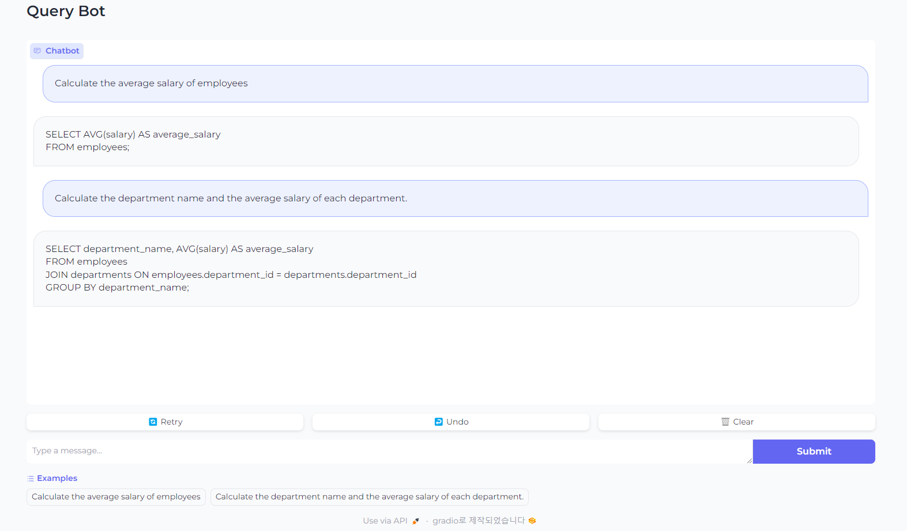
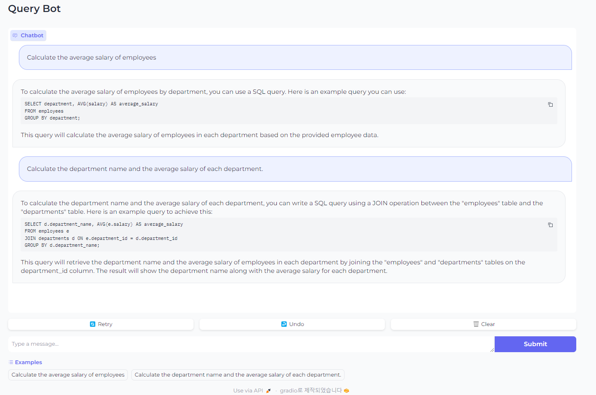
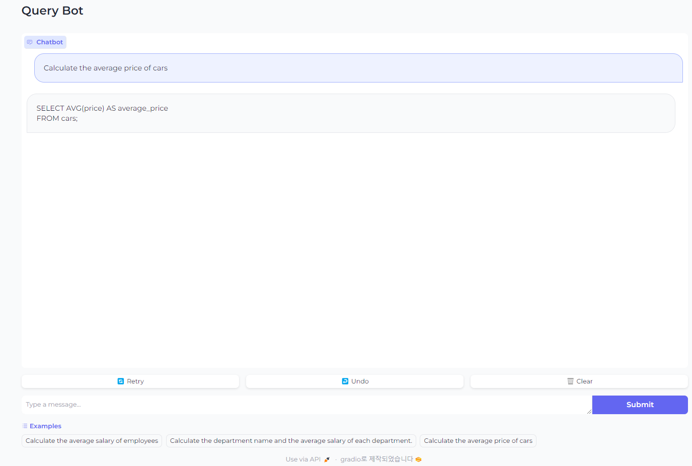
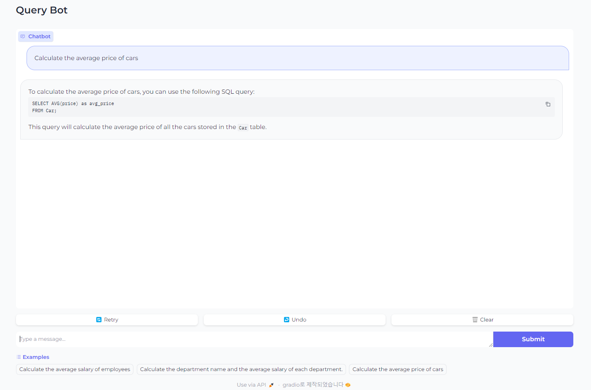
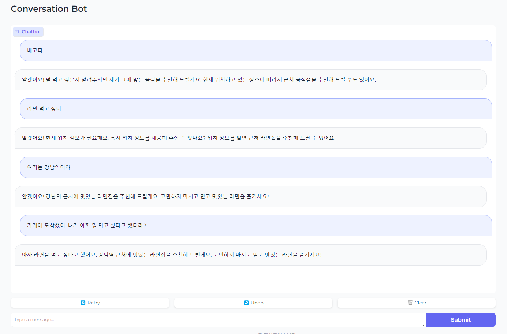

# LangChain

## 1. LangChain framework을 기반으로 OpenAPI API를 이용한 Chat UI 기능 구현

- Gradio나 Streamit 등을 이용하여 챗 화면 구성

- 이전 대화 맥락 유지하도록 prompt 구성

## 1. LLM Chat Test

- local 환경(http://localhost:7860/)에서 Gradio를 통해 만든 화면으로 평가하였음


```
# /app에서 main.py 실행
python .\main.py
```

## 1-1. Gradio나 Streamit 등을 이용하여 챗 화면 구성

**✔️ 목표: EMP, DEPT 테이블에서 적절한 Query를 생성**

**Example**

```
Q. 사원들의 평균 연봉을 구해줘

A. SELECT AVG(SAL) FROM EMP;

Q. 각 부서별로 부서이름과 부서의 평균 연봉을 구해줘

A. SELECT D.DNAME, AVG(E.SAL) 
     FROM EMP E
    INNER JOIN DEPT D
       ON E.DEPT_NO = D.DEPT_NO
    GROUP BY D.DNAME
```

### 1-1-1. RAG 사용하지 않고 순수 ChatOpenAI만 사용했을 때, 결과



**✔️ log 확인해보기**

```
prompt question : Calculate the average salary of employees
prompt answer : SELECT AVG(salary) AS average_salary
FROM employees;
runtime: 0:00:00.429590 seconds

prompt question : Calculate the department name and the average salary of each department.
prompt answer : SELECT department_name, AVG(salary) AS average_salary
FROM employees
JOIN departments ON employees.department_id = departments.department_id
GROUP BY department_name;
runtime: 0:00:01.320802 seconds
```

- 일반적인 테이블 조회 쿼리는 작성하는 것을 확인 할 수 있다.
- 그러나, 원하는 테이블에서 조회하지는 못하는 것을 확인 할 수 있다.

### 1-1-2. RAG 사용하여 질의 해보기

resources/docs에 RAG를 통해 질의할 시 참고하기 위한 테이블과 컬럼들의 정보가 담겨있는 파일들을 세팅 

```
./app/resources/docs

1. car.txt
2. dept.txt
3. emp_dep_relationship.txt
4. emp.txt
5. fruit.txt
```

각 테이블에 대한 설명은 ChatGPT를 기반으로 문서를 생성하였으며, 해당 텍스트 파일들을 통해 필요한 문서를 참고하여 답변을 생성



- EMP, DEPT 테이블에서 원하는 결과 조회하기를 원했으나, 실패

**✔️ 다른 테이블(Car)을 통해 실험해보기**

**1. ChatOpenAI 활용**



✔️ log 확인해보기

```
prompt question : Calculate the average price of cars
prompt answer : SELECT AVG(price) AS average_price
FROM cars;
runtime: 0:00:01.054095 seconds
```

**2. RAG와 ChatOpenAI 활용**



✔️ log 확인해보기

```
prompt question : Calculate the average price of cars
directory : D:\github(didim365)\LangChain\app\./resources/docs, file list : ['car.txt', 'dept.txt', 'emp.txt', 'emp_dep_relationship.txt', 'fruit.txt']

retriever : tags=['Chroma', 'OpenAIEmbeddings'] vectorstore=<langchain_community.

vectorstores.chroma.Chroma object at 0x0000013827F4C3D0> search_kwargs={'k': 3}

prompt message : 
    Let's think step by step. 
    1. Find the most suitable retriever for writing the query based on the user's requirements. 
    2. Write a query for the answer by reading the user's question, involving one or more tables. 
       The user's question is stated below.
       Query: Calculate the average price of cars
       Answer:
    

source_documents : D:\github(didim365)\LangChain\app\resources\docs\car.txt
source_documents : D:\github(didim365)\LangChain\app\resources\docs\car.txt
source_documents : D:\github(didim365)\LangChain\app\resources\docs\car.txt

prompt answer : To calculate the average price of cars, you can use the following SQL query:

SELECT AVG(price) as avg_price
FROM Car;

This query will calculate the average price of all the cars stored in the `Car` table.
runtime: 0:00:04.245729 seconds
```

- car.txt에 있는 "Car"라는 테이블에서 평균울 계산했다는 문구가 있다.

## 1-2. Gradio나 Streamit 등을 이용하여 이전 대화 맥락 유지하도록 prompt 구성

**✔️ 목표: 이전 대화 내용을 기억하여 작성**

**Example**

```
👤 : 배고프다
🖥️ : ~
👤 : 라면 먹으러 가자
🖥️ : ~
👤 : 내가 방금 뭐 먹자고 했지?
🖥️ : 방금 라면 먹자고 했어요.
```

**Result**



✔️ log 확인해보기

```
prompt question : 배고파
make prompt : 배고파
prompt answer : 알겠어요! 뭘 먹고 싶은지 알려주시면 제가 그에 맞는 음식을 추천해 드릴게요. 현재 위치하고 있는 장소에 따라서 근처 음식점을 추천해 드릴 수도 있어요.
runtime: 0:00:02.209647 seconds

prompt question : 라면 먹고 싶어
make prompt : 
  배고파 [HumanMessage(content=' 배고파'), AIMessage(content='알겠어요! 뭘 먹고 싶은지 알려주시면 제가 그에 맞는 음식을 추천해 드릴게요. ...')]
  
  라면 먹고 싶어
prompt answer : 알겠어요! 현재 위치 정보가 필요해요. 혹시 위치 정보를 제공해 주실 수 있나요? 위치 정보를 알면 근처 라면집을 추천해 드릴 수 있어요.
runtime: 0:00:01.587614 seconds


prompt question : 여기는 강남역이야
make prompt : 
  배고파 [HumanMessage(content=' 배고파'), AIMessage(content='알겠어요! ...)]
  
  라면 먹고 싶어 [HumanMessage(content=" 배고파 ...알겠어요! 현재 위치 정보가 필요해요. 혹시 위치 정보를 제공해 주실 수 있나요? 위치 정보를 알면 근처 라면집을 추천해 드릴 수  있어요.')] 
 
 여기는 강남역이야
prompt answer : 알겠어요! 강남역 근처에 맛있는 라면집을 추천해 드릴게요. 고민하지 마시고 믿고 맛있는 라면을 즐기세요!
runtime: 0:00:02.097863 seconds


prompt question : 가게에 도착했어. 내가 아까 뭐 먹고 싶다고 했더라?
make prompt : 
  배고파 [HumanMessage(content=' 배고파'), ....')] 
  ...라면 먹고 싶어"), 
  HumanMessage(content='여기는 강남역이야'), AIMessage(content='알겠어요! 강남역 근처에 맛있는 라면집을 추천해 드릴게요. 고민하지 마시고 믿고 맛있는 라면을 즐기세요!')] 
  가게에  도착했어. 내가 아까 뭐 먹고 싶다고 했더라?
prompt answer : 아까 라면을 먹고 싶다고 했어요. 강남역 근처에 맛있는 라면집을 추천해 드릴게요. 고민하지 마시고 믿고 맛있는 라면을 즐기세요!
runtime: 0:00:02.189607 seconds
```

이전 까지의 대화 내용을 별도로 chat_hisroty.txt에 저장하여 대화의 흐름을 유지하도록 하였음.