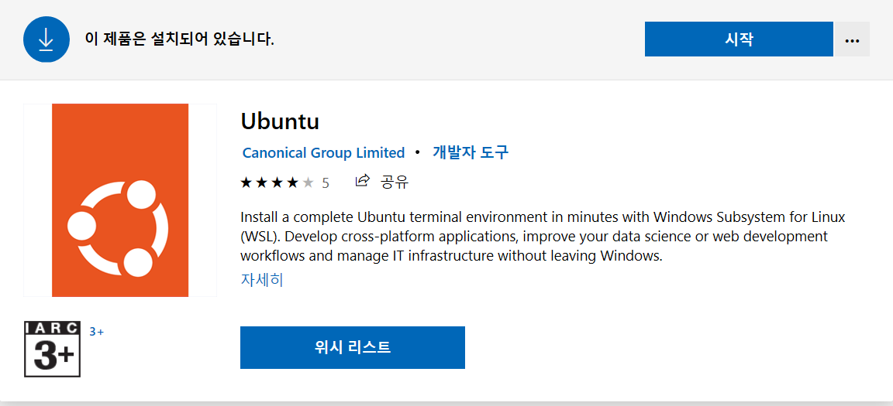
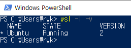
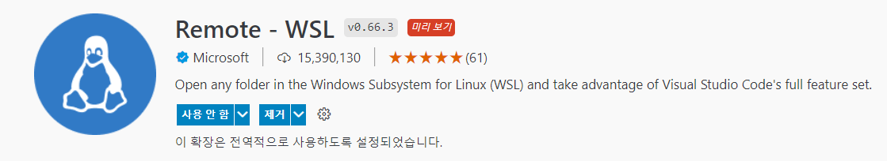

## day1-github구성

작성일 2022.07.12

작성자 윤요섭 인턴

## day1 과제

github 계정을 따고, 과제제출용 repository를 생성하세요.

wsl을 이용한 linux 환경구성 방법에 대해 보고서를 제출하시요.

## github 계정 및 과제제출용 repository

github user.email : imyoseob@gmail.com

github user.name : [Yun-Yoseob](https://github.com/Yun-Yoseob)

과제제출용 repository 주소 : [RedWoodK](https://github.com/Yun-Yoseob/RedWoodK)

## wsl을 이용한 linux 환경구성 방법

**✔ 참고링크**

[1. 환경구성 참고링크 클릭](https://www.youtube.com/watch?v=USDEGCf-EnI)


### WSL2 사용

1. [WSL2 정식 버전 구글링하기](https://www.lesstif.com/software-architect/wsl-2-windows-subsystem-for-linux-2-89555812.html) 

2. Window PowerShell 관리자권한으로 실행 후, 다음 명령어로 WSL 활성화

```
dism.exe /online /enable-feature /featurename:Microsoft-Windows-Subsystem-Linux /all /norestart
```

3. 다음 명령어로, WSL2가 사용하는 VM platform 옵션 활성화

```
dism.exe /online /enable-feature /featurename:VirtualMachinePlatform /all /norestart
```

4. Windows 재부팅해주기

5. Microsoft Store에서 Ubuntu 검색 및 설치 후 시작버튼 클릭



6. Ubuntu 실행후 username과 password 설정

7. wsl version을 1에서 2로 업데이트 하기 위해 다음 URL로 들어가서 업데이트 파일을 다운 받기

[WSL 2 Linux 커널 업데이트](https://docs.microsoft.com/ko-kr/windows/wsl/install-manual#step-4---download-the-linux-kernel-update-package)

8. 다음 명령어를 통해 WSL2로 변경하기

```
wsl --set-default-version 2
wsl --set-version Ubuntu 2
```

9. 다음 명령어를 통해 wsl version 확인하기

```
wsl -l -v
```


### VSCODE 설치하기 및 세팅

1. [VSCODE 구글링하여 들어가서 다운받기](https://code.visualstudio.com/)

2. VSCODE 확장에서 Remote-WSL 검색 후 설치



3. VSCODE 좌측 하단 녹색버튼 클릭 후, WSL폴더 열기 클릭

4. 터미널 ➡ 새 터미널 클릭하여 터미널 열기

5. Java 검색 후 Java Extension Pack 설치, vue 검색 후 Vetur 설치

### vue.js 설치

1. vscode 터미널에서 다음 명령어를 통해 설치 후, 확인

```
sudo apt install npm
npm --version

npm install -g @vue/cli
vue --version
```

2. vue project 생성

```
vue create test-vue
// test-vue 폴더명
```

3. ctrl-k ctrl-o를 눌러 vscode 폴더를 프로젝트 위치로 바꾼다.

```
/home/imyoseob/test-vue/
```

4. vscode 터미널 열고 npm run serve 입력 후, 디버깅 실행하여 되는지 확인

### VSCODE와 git 연동하기

1. Github에 계정 생성 후, Repository 만들기

2. VSCode 실행 후, f1을 눌러 git clone 검색

3. 연동할 git repository 선택

4. 연동할 로컬 저장소 선택 후 다음 명령어 입력

```
git init
git add README.md
git commit -m "first commit"
git branch -M main
git remote add origin https://github.com/Yun-Yoseob/RedWoodK.git
git push -u origin main
```

- git 명령어가 잘 실행되고 있는지 확인하려면 git status 입력
- repo와 remote가 되었는지 확인하려면 git remote -v 입력
- 이메일과 유저이름 관련 명령어

```
git config user.name "Yun-Yoseob"
git config user.email "imyoseob@gmail.com"
```