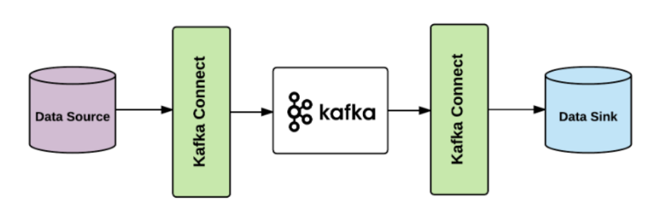

# 카프카 완벽가이드 - 커넥트 편(1편)

## Introduce Kafka Connect

카프카 Connect는 **Kafka 메시지 시스템**(Broker/Producer/Consumer)를 기반으로 다양한 **데이터 소스** 시스템(예: RDBMS)에서 발생한 데이터 이벤트를 다른 **데이터 타겟 시스템**으로 **별도의 Kafka Client 코딩 없이, Seamless 하게 실시간으로** 전달하기 위해서 만들어진 Kafka Component




### Kafka Connect 주요 구성요소

1. Connector

```
- Jdbc source/sink Connector

- debezium CDC source Connector

- Elasticsearch sink connector

- File Connector

- MongoDB source/sink Connector
```

2. Transformation

```
- SMT(Single Message Transformation)
```

3. Convertor

```
- JsonConverter
- AvroConverter
```

4. Config


