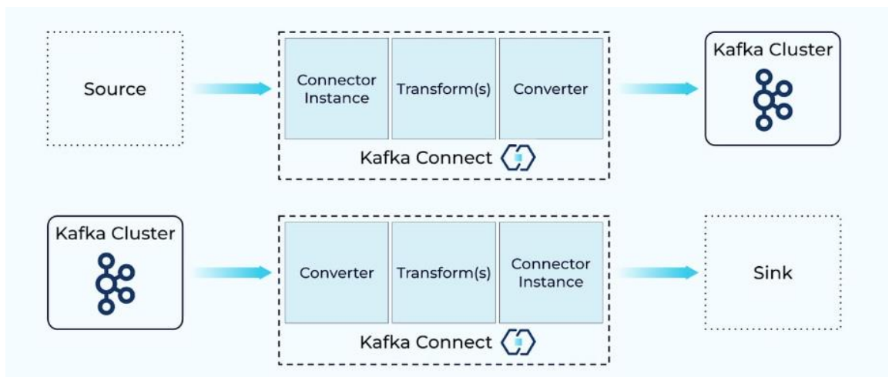
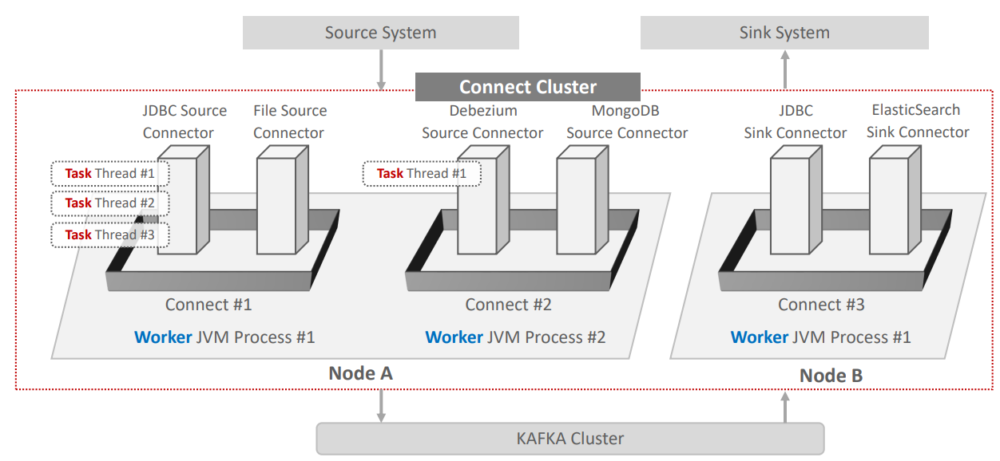
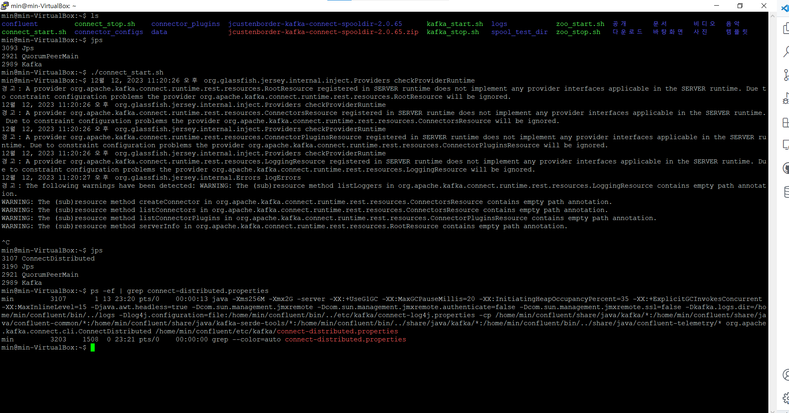

# 카프카 완벽가이드 - 커넥트 편(1편)

## Introduce Kafka Connect

카프카 Connect는 **Kafka 메시지 시스템**(Broker/Producer/Consumer)를 기반으로 다양한 **데이터 소스** 시스템(예: RDBMS)에서 발생한 데이터 이벤트를 다른 **데이터 타겟 시스템**으로 **별도의 Kafka Client 코딩 없이, Seamless 하게 실시간으로** 전달하기 위해서 만들어진 Kafka Component


## Kafka Connect 주요 구성요소

**1. Connector**

```
- Jdbc source/sink Connector

- debezium CDC source Connector

- Elasticsearch sink connector

- File Connector

- MongoDB source/sink Connector
```

**2. Transformation**

```
- SMT(Single Message Transformation)
```

**3. Convertor**

```
- JsonConverter
- AvroConverter
```

**4. Config**

**Kafka Connect 주요 구성요소 한 눈에 보기**



## Connect Cluster Architecture



### Connect, Connector, Worker, Task 정의

1. Connect: Connector를 기동 시키기 위한 Framework을 갖춘 JVM Process Model. Connect Process를 **Worker Process**로 지칭

2. Connect는 서로 다른 여러 개의 Connector Instance(클래스)들을 자신의 Framework 내부로 로딩하고 호출

3. Connector Instance의 실제 수행은 Thread 레벨로 수행되며 **Task**라고 함. Connector가 병렬 Thread 수행이 가능할 경우, 여러 개의 Task Thread들로 해당 Connector를 수행할 수 있음.

4. Connect는 Connect Cluster로 구성

5. Connect 유형은 Standalone과 Distributed mode로 나뉨. 단일 Worker Process로만 Connect Cluster 구성이 가능할 경우 Standalone mode, 여러 Worker Processs 구성이 가능할 경우 **Distributed mode**임

## Connect 구동 실습

- 구성환경은 KafkaConnect실습환경구축.md 참고

### Connect Default Setting으로 기동해보기

- 단일 서버로 localhost에서 Zookeeper와 Kafka 기동 후, connect-distributed.sh 실행
- 로그의 경우, 별도의 /logs 하위 디렉토리로 관리
- connect-distributed.sh을 실행시키기 위해, connect_start.sh을 별도로 만들어서 사용

**connect_start.sh**

```sh
log_suffix=`date +"%m%d%H%M"`

$CONFLUENT_HOME/bin/connect-distributed $CONFLUENT_HOME/etc/kafka/connect-distributed.properties > /home/min/logs/connect_console_log/connect_$log_suffix.log &
```



### connect-distributed.propertes 확인하기

```properties
# ** Kafka Server의 IP:PORT **
bootstrap.servers=localhost:9092

# **Connect Cluster가 동일한 group으로 모일수 있도록 group id 지정(Connect를 여러개 띄울경우)**
group.id=connect-cluster

# ...

# ** 내부 TOPIC **
offset.storage.topic=connect-offsets

# ...

# ** REST API로 Connect 인터페이스시 사용 **
#listeners=HTTP://:8083

# ...

# **  개별 Connector를 기동을 할 때, 개별 Connector들이 .jar로 되어 있는데,
# Connector가 어디 디렉토리에 있는지 보고, Connect가 .jar를 로딩하고 실행 할 수 있음 **
plugin.path=/usr/share/java
```

## Kafka Connect에 새로운 Connector 생성하기

**Kafka Connect에 새로운 Connector 생성 순서 및 유의사항**

1. Connector를 다운로드 받음. 하나의 Connector는 보통 여러 개의 jar library들로 구성됨.

2. 여러 개의 jar library로 구성된 하나의 Connector를 plugin.path로 지정된 디렉토리에 **별도의 서브 디렉토리**로 만들어서 jar library들을 이동 시켜야 함.

3. Kafka Connect는 기동시에 plugin.path로 지정된 디렉토리 밑의 서브 디렉토리에 위치한 모든 jar 파일을 로딩함.

4. Connector는 Conector명, Connector 클래스명, Connector **고유의 환경 설정**등을 **REST API**를 통해 Kafka Connect에 전달하여 새롭게 생성

5. REST API에서 성공 Response(HTTP 201)이 반환되더라도 **Kafka Connect Log 메시지를 반드시 확인하여** 제대로 Connector가 동작하는지 확인 필요

## REST API 기반의 Connect 관리

```
GET: 기동 중인 모든 Connector들의 리스트, 개별 Connector의 config와 현재 상태

POST: Connector 생성 등록, 개별 Connector 재 기동.

PUT: Connector 일시 정지 및 재시작, Connector의 새로운 config 등록, Config validation

DELETE: Connector 삭제
```

## Schema

### Schema의 필요성

**Spooldir Source Connector 예시**

```
Spooldir Source Connector

- 특정 디렉토리에 위치한 CSV, JSON 포맷 등의 파일들을 Event Message로 만들어서 Kafka로 전송하는 Source Connector

- 해당 디렉토리를 주기적으로 모니터링 수행하면서 새로운 파일이 생성될 때마다 Kafka로 전송
```

**🤔 CASE1 : Spooldir Source Connector를 통해 CSV를 Serialization을 통해서 바이트 스트림으로 Kafka에 전송 후, Deserialization을 통해서 원본 객체로 수행할 경우**

```
StringSerializer를 통해 직렬화하고, 이를 다시 StringDeserializer를 통해 역직렬화 하여 타겟 DB에 입력하는 로직을 만들 경우, 각 컬럼별 데이터 타입은 어떻게 반영할 것인지???
```

- Custom 자바 객체를 통해, 객체를 생성하여 데이터를 연동하고 이 때, 각 컬럼별 데이터 타입을 반영 하여 데이터를 연동 할 수 있다.

```java
/**
 *  Custom Java 객체를 생성하여 데이터 연동 예시
*/
public class OrderModel implements Serializable {
    public String orderId;
    public String shopId;
    public String menuName;
    public String userName;
    public String phoneNumber;
    public String address;
    public LocalDateTime orderTime;

    public OrderModel(String orderId, String shopId, String menuName, String userName,String phoneNumber, String address, LocalDateTime orderTime) {
        this.orderId = orderId;
        this.shopId = shopId;
        this.menuName = menuName;
        this.userName = userName;
        this.phoneNumber = phoneNumber;
        this.address = address;
        this.orderTime = orderTime;
    }
```

**🤔 CASE2: 수많은 테이블의 Schema 정보를 어떻게 관리할 것인가?**

- 수많은 테이블의 Schema 정보를 모두 Custom 자바 객체로 만들기 어려움
- Schema 정보가 추가/변경/삭제시마다 Custom 자바 객체를 변경하기 어려움

➡ 카프카 Connect의 연동 대상은 대부분 Schema 기반의 시스템

➡ 연동 시 Schema를 기반으로 효율적으로 Source 데이터와 Sink 데이터를 표현 할 수 있는 별도의 공통 방식(포맷)이 필요

### Converter를 통한 Schema 메시지 전송

**Converter 지원 포맷**

```
- Json
- Avro
- Protobuf
- String
- ByteArray
```

**Converter 자동 포맷 예시**

```json
{
    "schema": {
    "type": "struct",
    "fields": [
        {
        "type": "int32",
        "optional": false,
        "field": "customer_id"
        },
        {
        "type": "string",
        "optional": false,
        "field": "email_address"
        },
        {
        "type": "string",
        "optional": false,
        "field": "full_name"
        }
    ],
    "optional": false,
    "name": "mysql02.oc.customers.Value"
    },
    "payload": {
    "customer_id": 864,
    "email_address": "testuser_864",
    "full_name": "testuser_864"
    }
}
```

- Json/Avro 포맷의 경우 **schema**와 **payload**로 구성
- Schema는 해당 레코드의 schema 구성을, payload는 해당 레코드의 값을 가짐
- Connector 별로 Json 포맷은 조금씩 다를수 있지만 전반적으로 대부분 비슷
- **Json Schema의 경우 레코드 별로 Schema를 가지고 있으므로** 메시지 용량이 커짐. 이의 개선을 위해 Avro Format과 Schema Registry를 이용하여 Schema 정보의 중복 생성 제거

### Schema Registry를 이용한 Schema 정보 중복 전송 제거

- Confluent Kafka는 Schema Registry를 통해 Schema 정보를 별도로 관리하는 기능 제공
- 토픽으로 전송되는 Data의 Schema는 Schema Registry에서 ID + Version 별로 중앙 관리되므로 레코드 별로 Schema를 중복해서 전송할 필요가 없음.

