# 카프카 완벽가이드 - 커넥트 편(1편)

```
카프카 완벽가이드 - 커넥트 편(1편)에서는 카프카 커넥트의 핵심 구성 요소에 대해 알아본다.
```

## Introduce Kafka Connect

카프카 Connect는 **Kafka 메시지 시스템**(Broker/Producer/Consumer)를 기반으로 다양한 **데이터 소스** 시스템(예: RDBMS)에서 발생한 데이터 이벤트를 다른 **데이터 타겟 시스템**으로 **별도의 Kafka Client 코딩 없이, Seamless 하게 실시간으로** 전달하기 위해서 만들어진 Kafka Component

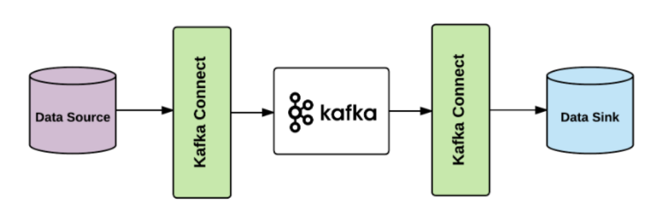

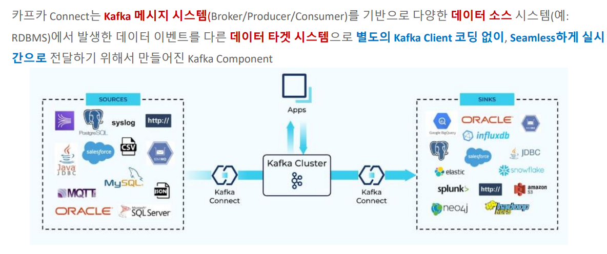

## Kafka Connect 주요 구성요소

**1. Connector**

```
- Jdbc source/sink Connector

- debezium CDC source Connector

- Elasticsearch sink connector

- File Connector

- MongoDB source/sink Connector
```

**2. Transformation**

```
- SMT(Single Message Transformation)
```

**3. Convertor**

```
- JsonConverter
- AvroConverter
```

**4. Config**

**Kafka Connect 주요 구성요소 한 눈에 보기**


## Connect Cluster Architecture

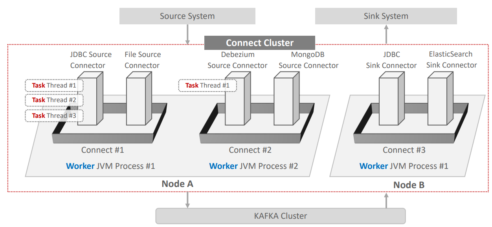

### Connect, Connector, Worker, Task 정의

1. Connect: Connector를 기동 시키기 위한 Framework을 갖춘 JVM Process Model. Connect Process를 **Worker Process**로 지칭

2. Connect는 서로 다른 여러 개의 Connector Instance(클래스)들을 자신의 Framework 내부로 로딩하고 호출

3. Connector Instance의 실제 수행은 Thread 레벨로 수행되며 **Task**라고 함. Connector가 병렬 Thread 수행이 가능할 경우, 여러 개의 Task Thread들로 해당 Connector를 수행할 수 있음.

4. Connect는 Connect Cluster로 구성

5. Connect 유형은 Standalone과 Distributed mode로 나뉨. 단일 Worker Process로만 Connect Cluster 구성이 가능할 경우 Standalone mode, 여러 Worker Processs 구성이 가능할 경우 **Distributed mode**임


### Connector의 유형


### 1. Source Connector

**Source** 시스템(RDBMS 등)에서 **Kafka Broker**로 데이터 전송

**Source Connector**
```
- JDBC(**Source**/Sink) Connector
- Debezium CDC Source Connector (MySQL, Postgresql, Oracle, MongoDB 등)
- File System Source Connector
- MongoDB(**Source**/Sink) Connector
- S3 Source Connector
...
```

### 2. Sink Connector

**Kafka Broker**에서 **Target** 시스템(RDBMS 등)으로 데이터 전송

**Sink Connector**
```
- JDBC(Source/**Sink**) Connector
- Elasticsearch Sink Connector
- Snowflake Sink Connector
- Redshift Sink Connector
- Bigquery Sink Connector
- S3 Sink Connector
...
```

## Connect 구동 실습

- 구성환경은 KafkaConnect실습환경구축.md 참고

### Connect Default Setting으로 기동해보기

- 단일 서버로 localhost에서 Zookeeper와 Kafka 를 별도의 쉘을 만들어서 각각 기동 후, connect-distributed.sh 실행
- 로그의 경우, 별도의 /logs 하위 디렉토리로 관리
- connect-distributed.sh을 실행시키기 위해, connect_start.sh을 별도로 만들어서 사용

**connect_start.sh**

```sh
log_suffix=`date +"%m%d%H%M"`

$CONFLUENT_HOME/bin/connect-distributed $CONFLUENT_HOME/etc/kafka/connect-distributed.properties > /home/min/logs/connect_console_log/connect_$log_suffix.log &
```

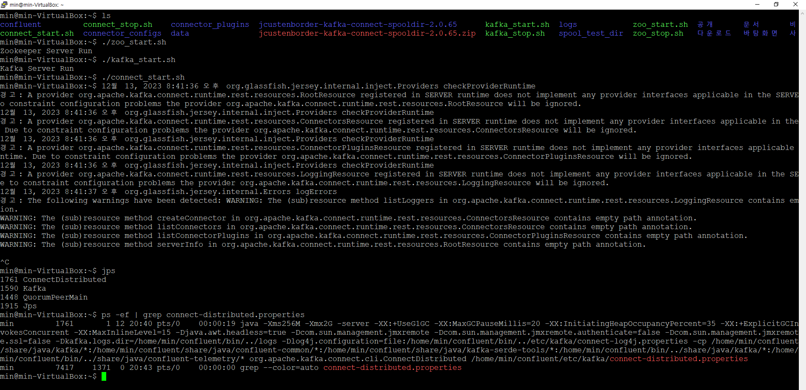


**kafka connect log 확인하기**

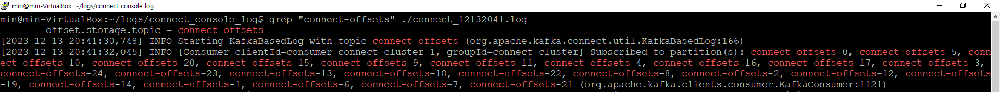

log를 확인해보면, 토픽들에 대한 내용들이 출력되는 것을 확인할 수 있다.

### Connect의 내부 정보 Topic들

<hr>

**kafka connect 기동 후, 내부 정보 토픽 살펴보기**

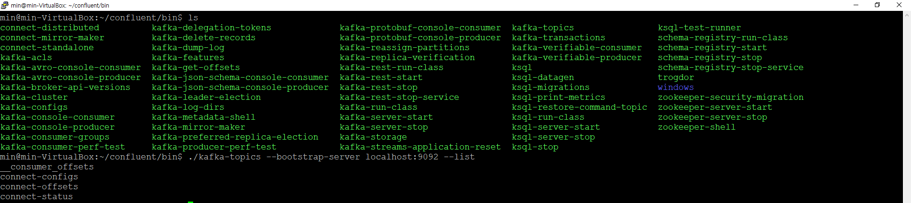

토픽을 따로 생성하지 않았는데, 토픽들이 생성된 것을 확인할 수 있다.

Kafka Connect는 Connector의 메시지 처리 offset 및 Connector별 config와 상태 정보를 내부 토픽에 저장한다.

**Connect의 내부 정보 Topic들**

|토픽명|설명|
|:--:|--|
|connect-offsets|Source Connector별로 메시지를 전송한 offset 정보를 가지고 있음. <br> 한번 전송한 메시지를 **중복 전송**하지 않기 위함. <br> 기본 25개의 partition으로 구성.|
|connect-configs|Connector의 config 정보를 가짐. Connect 재기동 시 설정된 Connector를 기동|
|connect-status|Connector의 상태 정보를 가짐. Connect 재기동시 설정된 Connector를 기동|
|__consumer_offsets|Consumer가 읽어들인 메시지의 offset 정보를 가지고 있음. <br> Sink Connector가 읽어 들인 메시지 offset 정보를 가짐. <br> 한번 읽어 들인 메시지를 **중복해서** 읽지 않기 위함. <br> 기본 50개의 partition으로 구성.|


### REST API 기반의 Connect 관리

<hr>

**Kafka Connect 실행 전**

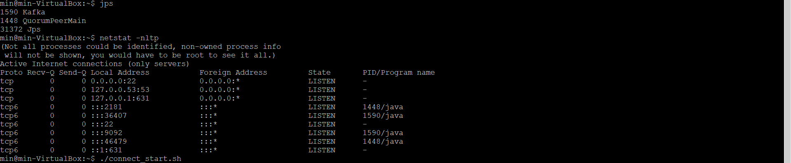

**Kafka Connect 실행 후**

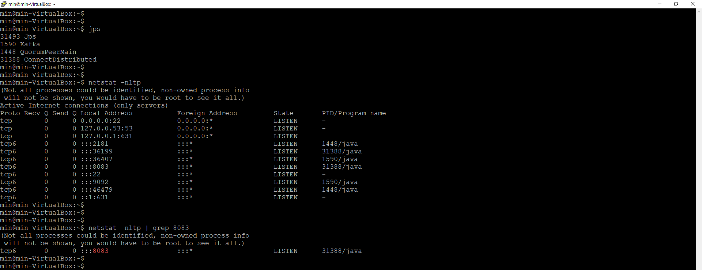

Kafka Connect를 실행시키면 8083포트를 LISTEN하는 것을 확인할 수 있다.

Kafka Connect는 REST API 기반으로 관리 할 수 있다.


**REST API 기반의 Connect 관리: HTTP Method**

```
GET: 기동 중인 모든 Connector들의 리스트, 개별 Connector의 config와 현재 상태

POST: Connector 생성 등록, 개별 Connector 재 기동.

PUT: Connector 일시 정지 및 재시작, Connector의 새로운 config 등록, Config validation

DELETE: Connector 삭제
```

**PORT 및 내부 토픽에 대한 설정은 $CONFLUENT/etc/kafka/connect-distributed.properties 파일에서 설정할 수 있다.**

## connect-distributed.propertes 확인하기

```properties
# ** Kafka Server의 IP:PORT **
bootstrap.servers=localhost:9092

# **Connect Cluster가 동일한 group으로 모일수 있도록 group id 지정(Connect를 여러개 띄울경우)**
group.id=connect-cluster

# ...

# ** 내부 TOPIC **
offset.storage.topic=connect-offsets

# ...

# ** REST API로 Connect 인터페이스시 사용 **
listeners=HTTP://:8083

# ...

# **  개별 Connector를 기동을 할 때, 개별 Connector들이 .jar로 되어 있는데,
# Connector가 어디 디렉토리에 있는지 보고, Connect가 .jar를 로딩하고 실행 할 수 있음 **
plugin.path=/usr/share/java
```

## Kafka Connect에 새로운 Connector 생성하기

**Kafka Connect에 새로운 Connector 생성 순서 및 유의사항**

1. Connector를 다운로드 받음. 하나의 Connector는 보통 여러 개의 jar library들로 구성됨.

2. 여러 개의 jar library로 구성된 하나의 Connector를 plugin.path로 지정된 디렉토리에 **별도의 서브 디렉토리**로 만들어서 jar library들을 이동 시켜야 함.

3. Kafka Connect는 기동시에 **plugin.path**로 지정된 디렉토리 밑의 서브 디렉토리에 위치한 모든 jar 파일을 로딩함.

4. Connector는 Conector명, Connector 클래스명, Connector **고유의 환경 설정**등을 **REST API**를 통해 Kafka Connect에 전달하여 새롭게 생성

5. REST API에서 성공 Response(HTTP 201)이 반환되더라도 **Kafka Connect Log 메시지를 반드시 확인하여** 제대로 Connector가 동작하는지 확인 필요

## SMT(Single Message Transform)

**SMT: Connect에서 메시지의 변환을 위해 제공하는 라이브러리**

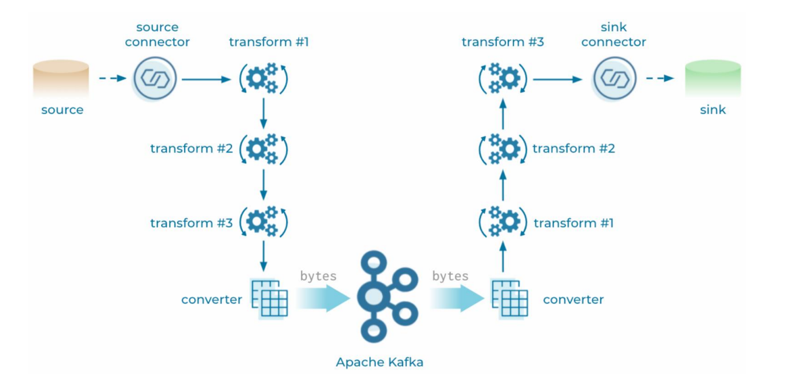

### SMT 특징

1. Source 시스템의 메시지를 **kafka로 전송전에** 변환하거나 kafka에서 Sink 시스템으로 **데이터를 입력하기 전**에 변환할 때 적용

2. Connect는 Connector와 Config 만으로 인터페이스 하므로 메시지 변환도 **Config에서 SMT를 기술하여** 적용해야 함.

3. SMT가 제공하는 변환 기능은 SMT를 구현한 Java 클래스를 기반으로 제공되며, Kafka Connect는 기본적인 SMT 클래스를 가지고 있음.

4. Connect에서 기본제공하는 SMT 클래스외에 3rd Party에서 별도의 SMT를 Plugin 형태로 제공할 수도 있음.

5. SMT 변환은 Chain 형태로 연속해서 적용할 수 있음.

6. **복잡한** 데이터 변환은 한계가 있음.

### 다양한 SMT 기본 클래스들

|SMT 클래스|설명|
|:--:|--|
|ValueToKey|Value record에 있는 필드를 Key 필드로 변환하기 위해 사용. 주로 jdbc source connector에서 Key 지정시 사용|
|ExtractField|여러 개의 내부 필드들을 가지는 Struct와 Map 메시지에서 특정 한 개의 필드를 추출할 때 사용|
|RegexRouter|지정된 정규 표현식에 맞춰서 토픽명을 변경|
|ReplaceField|특정 필드들을 제외하거나 새로운 필드명을 부여|
|Filter|특정 조건에 따라 메시지를 필터링 수행.|
|Flatten|Nested 구조의 메시지를 concat하여 변환|
|InsertField|새로운 필드를 추가|
|TimestampConverter|서로 다른 timestamp 포맷간의 변환 수행.|

### SMT를 이용한 Topic명 변경

- org.apache.kafka.connect.transforms.RegexRouter는 Topic 명을 변경하기 위한 SMT

- Topic 명 변경을 위해 SMT에서 **정규 표현식**을 사용함

- 주요 속성으로 regex 와 replacement를 가짐

- regex는 Topic명 매칭을 위한 정규 표현식

- replacement는 매칭된 표현식에 대체될 문자열

## Schema

### Schema의 필요성

**Spooldir Source Connector 예시**

```
Spooldir Source Connector

- 특정 디렉토리에 위치한 CSV, JSON 포맷 등의 파일들을 Event Message로 만들어서 Kafka로 전송하는 Source Connector

- 해당 디렉토리를 주기적으로 모니터링 수행하면서 새로운 파일이 생성될 때마다 Kafka로 전송
```

**🤔 CASE1 : Spooldir Source Connector를 통해 CSV를 Serialization을 통해서 바이트 스트림으로 Kafka에 전송 후, Deserialization을 통해서 원본 객체로 수행할 경우**

```
StringSerializer를 통해 직렬화하고, 이를 다시 StringDeserializer를 통해 역직렬화 하여 타겟 DB에 입력하는 로직을 만들 경우, 각 컬럼별 데이터 타입은 어떻게 반영할 것인지???
```

- Custom 자바 객체를 통해, 객체를 생성하여 데이터를 연동하고 이 때, 각 컬럼별 데이터 타입을 반영 하여 데이터를 연동 할 수 있다.

```java
/**
 *  Custom Java 객체를 생성하여 데이터 연동 예시
*/
public class OrderModel implements Serializable {
    public String orderId;
    public String shopId;
    public String menuName;
    public String userName;
    public String phoneNumber;
    public String address;
    public LocalDateTime orderTime;

    public OrderModel(String orderId, String shopId, String menuName, String userName,String phoneNumber, String address, LocalDateTime orderTime) {
        this.orderId = orderId;
        this.shopId = shopId;
        this.menuName = menuName;
        this.userName = userName;
        this.phoneNumber = phoneNumber;
        this.address = address;
        this.orderTime = orderTime;
    }
```

**🤔 CASE2: 수많은 테이블의 Schema 정보를 어떻게 관리할 것인가?**

- 수많은 테이블의 Schema 정보를 모두 Custom 자바 객체로 만들기 어려움
- Schema 정보가 추가/변경/삭제시마다 Custom 자바 객체를 변경하기 어려움

➡ 카프카 Connect의 연동 대상은 대부분 Schema 기반의 시스템

➡ 연동 시 Schema를 기반으로 효율적으로 Source 데이터와 Sink 데이터를 표현 할 수 있는 별도의 공통 방식(포맷)이 필요

### Converter를 통한 Schema 메시지 전송

**Converter 지원 포맷**

```
- Json
- Avro
- Protobuf
- String
- ByteArray
```

**Converter 자동 포맷 예시**

```json
{
    "schema": {
    "type": "struct",
    "fields": [
        {
        "type": "int32",
        "optional": false,
        "field": "customer_id"
        },
        {
        "type": "string",
        "optional": false,
        "field": "email_address"
        },
        {
        "type": "string",
        "optional": false,
        "field": "full_name"
        }
    ],
    "optional": false,
    "name": "mysql02.oc.customers.Value"
    },
    "payload": {
    "customer_id": 864,
    "email_address": "testuser_864",
    "full_name": "testuser_864"
    }
}
```

- Json/Avro 포맷의 경우 **schema**와 **payload**로 구성
- Schema는 해당 레코드의 schema 구성을, payload는 해당 레코드의 값을 가짐
- Connector 별로 Json 포맷은 조금씩 다를수 있지만 전반적으로 대부분 비슷
- **Json Schema의 경우 레코드 별로 Schema를 가지고 있으므로** 메시지 용량이 커짐. 이의 개선을 위해 Avro Format과 Schema Registry를 이용하여 Schema 정보의 중복 생성 제거

### Schema Registry를 이용한 Schema 정보 중복 전송 제거

- Confluent Kafka는 Schema Registry를 통해 Schema 정보를 별도로 관리하는 기능 제공
- 토픽으로 전송되는 Data의 Schema는 Schema Registry에서 ID + Version 별로 중앙 관리되므로 레코드 별로 Schema를 중복해서 전송할 필요가 없음.

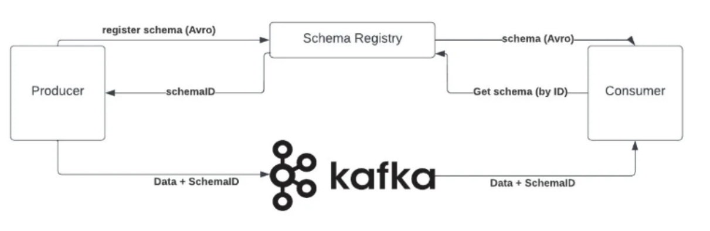

**Schema Registry의 주요 역할**

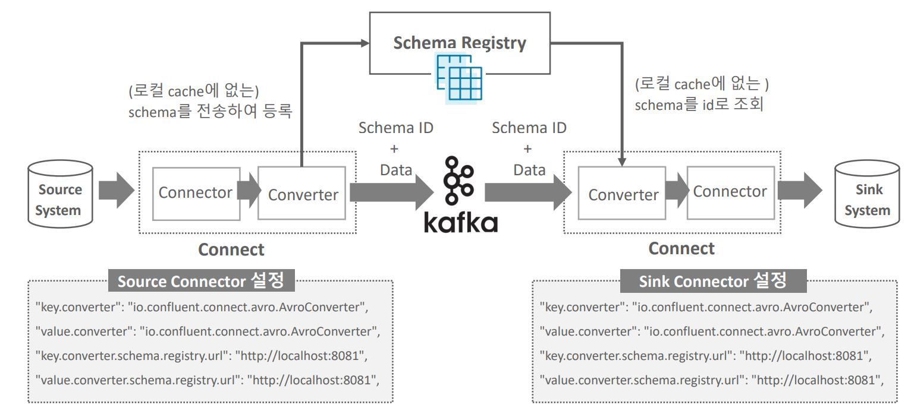

- Schema를 전송하지 않고 레코드의 값만 Kafka로 전송할 수 있게 해줌
- Kafka 메시지의 Schema 제약 조건을 유지하면서 Schema 변화에 대한 일정 수준 호환성(Compatibility)을 제공

**Schema registry 등록 주요 정보**

Schema registry는 주요 정보를 kafka의 내부 토픽인 _schemas에 저장하며 주요 요소는 아래와 같음.

|주요 요소|설명|
|:--:|--|
|subjects|- Schema Registry에 등록된 토픽별(또는 토픽 레코드 유형별) 기준정보 <br> - Subject내의 스키마 호환성(compatibility) 체크 <br> - Version은 subject내에서 변경 <br> - Schema가 진화할 때 동일한 subject에서 새로운 schema id와 version을 가짐|
|schemas|- schema 정보|
|config|- 전역 또는 subject별 스키마 호환성(compatibility) 관련 정보 저장|

- 스키마 호환성(compatility)란?

```
서로 다른 애플리케이션은 동일한 업무로직에 포함된 쓰기와 읽기 스키마가 서로 달라질 수 있는 상황에 대해 스키마 호환성 지원을 통해 **유연하게 해당 상황을 대처**할 수 있다.

하지만, 너무 다양하게 변하는 스키마를 호환성으로 지원한다면 해당 스키마에 기반한 전체 메시지는 (스키마 적용의 당위성이 훼손 될 만큼) **데이터 일관성이 없어질 수 있다.**

- 하위 호환성: 새로운 버전의 읽기 스키마는 예전 버전의 쓰기 스키마를 처리 할 수 있다.
- 상위 호환성: 예전 버전의 읽기 스키마는 새로운 버전의 쓰기 스키마를 처리 할 수 있다.
```

**REST API를 통한 Schema Registry 관리**

- GET, POST, PUT, DELETE Method 기반의 REST API를 통해 Schema Registry 관리 수행.
- Subject 및 Config의 정보 추출 및 주요 속성에 대한 수정/변경/삭제 가능
- 가급적 Delete는 자제. Delete 수행 시 Soft Delete이후 다시 Hard Delete를 수행해야 완전 삭제

- Config는 Subject 별로 별도 설정하지 않으면 전역 config를 그대로 따름