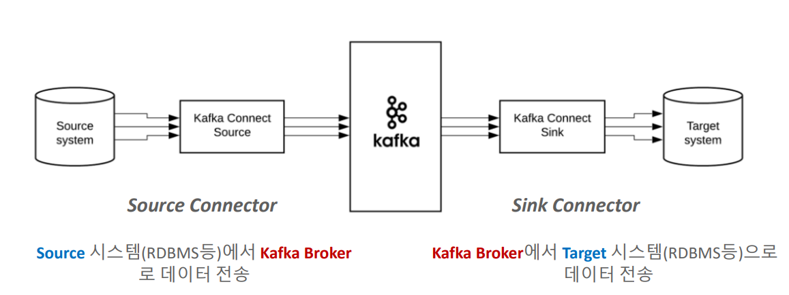

# 카프카 완벽가이드 - 커넥트 편(2편)

## Connector의 유형





### 1. Source Connector

**Source** 시스템(RDBMS 등)에서 **Kafka Broker**로 데이터 전송

**Source Connector**
```
- JDBC(**Source**/Sink) Connector
- Debezium CDC Source Connector (MySQL, Postgresql, Oracle, MongoDB 등)
- File System Source Connector
- MongoDB(**Source**/Sink) Connector
- S3 Source Connector
...
```

### 2. Sink Connector

**Kafka Broker**에서 **Target** 시스템(RDBMS 등)으로 데이터 전송

**Sink Connector**
```
- JDBC(Source/**Sink**) Connector
- Elasticsearch Sink Connector
- Snowflake Sink Connector
- Redshift Sink Connector
- Bigquery Sink Connector
- S3 Sink Connector
...
```
