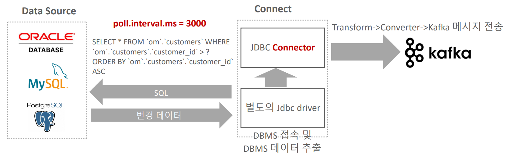
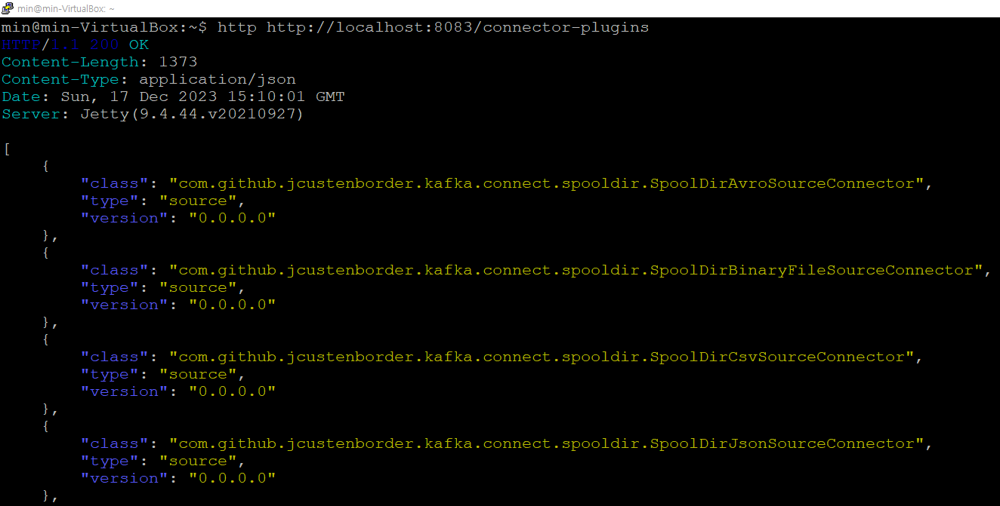
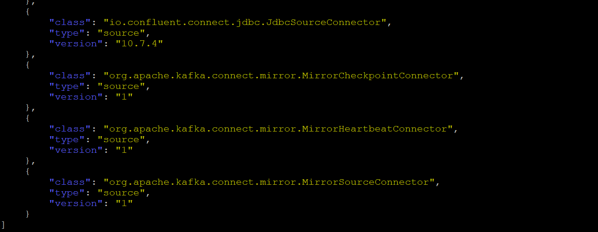
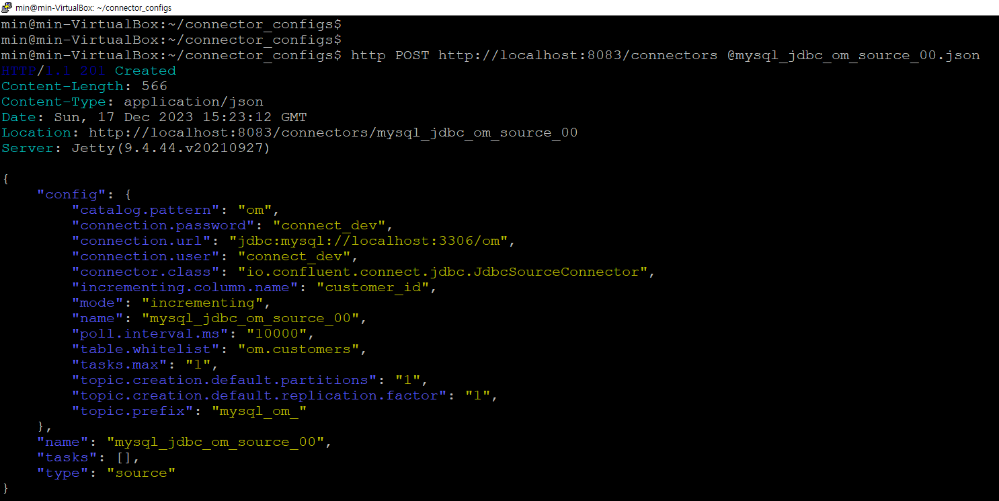
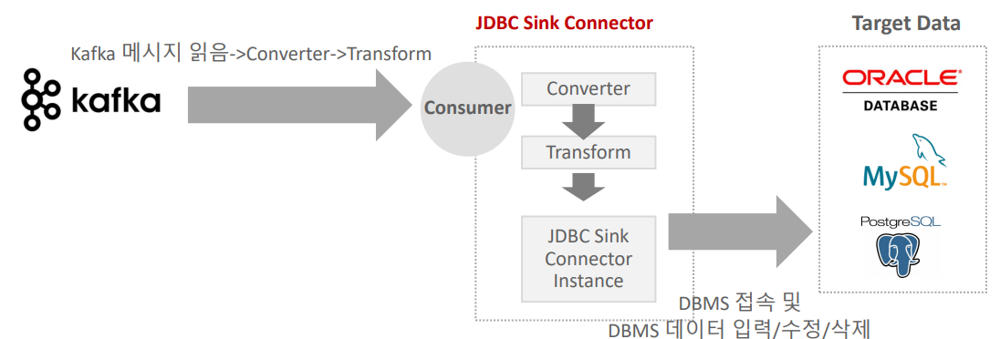
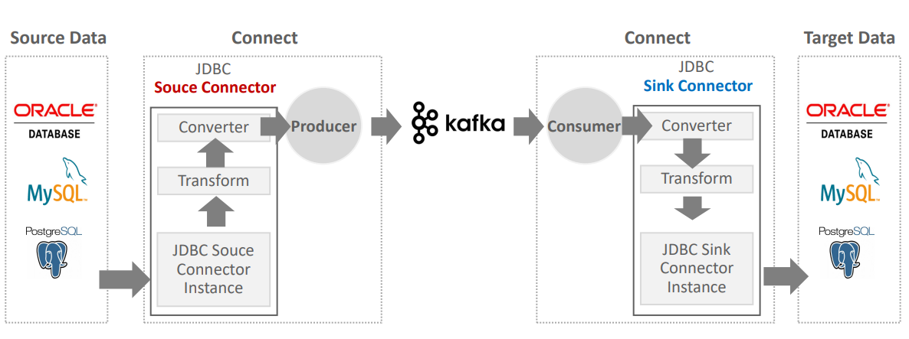

# 카프카 완벽가이드 - 커넥트 편(2편)

```
카프카 완벽가이드 - 커넥트 편(2편)에서는 카프카 커넥트에서 Connector Instance(클래스)들을 로딩하고 호출하는 과정과 Source/Sink Connector를 통한 데이터 전송 과정에 대해 알아본다.
```

## Connector의 유형


### 1. Source Connector

**Source** 시스템(RDBMS 등)에서 **Kafka Broker**로 데이터 전송

**Source Connector**
```
- JDBC(**Source**/Sink) Connector
- Debezium CDC Source Connector (MySQL, Postgresql, Oracle, MongoDB 등)
- File System Source Connector
- MongoDB(**Source**/Sink) Connector
- S3 Source Connector
...
```

### 2. Sink Connector

**Kafka Broker**에서 **Target** 시스템(RDBMS 등)으로 데이터 전송

**Sink Connector**
```
- JDBC(Source/**Sink**) Connector
- Elasticsearch Sink Connector
- Snowflake Sink Connector
- Redshift Sink Connector
- Bigquery Sink Connector
- S3 Sink Connector
...
```

## Spooldir Source Connector

### Spooldir Source Connector

- 특정 디렉토리에 위치한 CSV, Json 포맷 등의 파일들을 Event Message로 만들어서 Kafka로 전송하는 Source Connector
- 해당 디렉토리를 주기적으로 모니터링 수행하면서 새로운 파일이 생성될 때마다 kafka로 메시지 전송

### 환경 구성하기

**TO-DO LIST**

0. connect-distributed.properties에서 plugin.path가 지정되어 있지 않은 경우 plugin.path 잡아주기

1. config 파일 생성
2. Spooldir Source Connector 다운로드 받은 뒤, 압축 풀기 (jcustenborder-kafka-connect-spooldir-2.0.65.zip)
3. Spooldir Source Connector 하위 디렉토리 lib을 plugin.path의 서브 디렉토리로 옮기고 config 파일에서 설정한 디렉토리명으로 변경
4. config 파일에서 설정한 대로 디렉토리 설정 및 파일 준비
5. 모든 준비가 끝났으면 REST API를 이용하여 config 파일을 Connect로 등록하여 신규 Spool Dir Source connector 생성
6. 제대로 동작하는지 Connect log 또는 REST API로 확인
7. Kafka broker에 제대로 전송되었는지 토픽 및 consumer로 확인
8. Source Connector가 Kafka Topic으로 메시지 전송이 완료된 후 원래 파일을 이동시키는 디렉토리에 파일이 있는지 확인

### Spooldir Source Connector 실습

**0. connect-distributed.properties의 plugin.path 설정**

```properties
# **  개별 Connector를 기동을 할 때, 개별 Connector들이 .jar로 되어 있는데,
# Connector가 어디 디렉토리에 있는지 보고, Connect가 .jar를 로딩하고 실행 할 수 있음 **
plugin.path=/home/min/connector_plugins
```

**1. Spooldir Source Connector의 config 파일 만들기**

- spooldir_source.json

```json
{
  "name": "csv_spooldir_source",
  "config": {
    "tasks.max": "1",
    "connector.class": "com.github.jcustenborder.kafka.connect.spooldir.SpoolDirCsvSourceConnector",
    "input.path": "/home/min/spool_test_dir",
    "input.file.pattern": "^.*\\.csv$",
    "error.path": "/home/min/spool_test_dir/error",
    "finished.path": "/home/min/spool_test_dir/finished",
    "empty.poll.wait.ms": 30000,
    "halt.on.error": "false",
    "topic": "spooldir-test-topic",
    "csv.first.row.as.header": "true",
    "schema.generation.enabled": "true"
   }
}
```

**2~3. Spooldir Source Connector lib 디렉토리를 spooldir_source으로 변경하여 plugin.path에 복사** 

```
min@min-VirtualBox:~/connector_plugins$ ls -R
.:
spooldir_source

./spooldir_source:
commons-beanutils-1.9.4.jar         connect-utils-jackson-0.7.173.jar
commons-collections-3.2.2.jar       connect-utils-parser-0.7.173.jar
commons-collections4-4.2.jar        extended-log-format-0.0.2.13.jar
commons-compress-1.22-SNAPSHOT.jar  freemarker-2.3.31.jar
commons-lang3-3.8.1.jar             kafka-connect-spooldir-2.0.65.jar
commons-logging-1.2.jar             opencsv-4.6.jar
commons-text-1.3.jar                value-2.5.5.jar
connect-utils-0.7.173.jar
```

**4. config 파일에서 설정한 대로 디렉토리 설정 및 파일 준비**

```
min@min-VirtualBox:~/spool_test_dir$ pwd
/home/min/spool_test_dir
min@min-VirtualBox:~/spool_test_dir$ ls
csv-spooldir-source.csv  error  finished
```

**5. 모든 준비가 끝났으면 REST API를 이용하여 config 파일을 Connect로 등록하여 신규 Spool Dir Source connector 생성**

```
min@min-VirtualBox:~/connector_configs$ pwd
/home/min/connector_configs

min@min-VirtualBox:~/connector_configs$ ls
spooldir_source.json

min@min-VirtualBox:~/connector_configs$ curl -X POST -H "Content-Type: application/json" http://localhost:8083/connectors --data @spooldir_source.json

{"name":"csv_spooldir_source","config":{"tasks.max":"1","connector.class":"com.github.jcustenborder.kafka.connect.spooldir.SpoolDirCsvSourceConnector","input.path":"/home/min/spool_test_dir","input.file.pattern":"^.*\\.csv$","error.path":"/home/min/spool_test_dir/error","finished.path":"/home/min/spool_test_dir/finished","empty.poll.wait.ms":"30000","halt.on.error":"false","topic":"spooldir-test-topic","csv.first.row.as.header":"true","schema.generation.enabled":"true","name":"csv_spooldir_source"},"tasks":[],"type":"source"}
```

**6. 제대로 동작하는지 Connect log 또는 REST API로 확인**

- REST API 확인

```
min@min-VirtualBox:~/connector_configs$ curl -X GET http://localhost:8083/connectors/csv_spooldir_source/status | jq '.'

  % Total    % Received % Xferd  Average Speed   Time    Time     Time  Current
                                 Dload  Upload   Total   Spent    Left  Speed
100   173  100   173    0     0   7521      0 --:--:-- --:--:-- --:--:--  7521
{
  "name": "csv_spooldir_source",
  "connector": {
    "state": "RUNNING",
    "worker_id": "127.0.1.1:8083"
  },
  "tasks": [
    {
      "id": 0,
      "state": "RUNNING",
      "worker_id": "127.0.1.1:8083"
    }
  ],
  "type": "source"
}
```

- Connect log로 확인
```
2023-12-14 01:22:33,204] INFO [csv_spooldir_source|task-0] SpoolDirCsvSourceConnectorConfig 
values:
        batch.size = 1000
        ...
        empty.poll.wait.ms = 30000
        error.path = /home/min/spool_test_dir/error
        ...
        finished.path = /home/min/spool_test_dir/finished
        ...
        input.file.pattern = ^.*\.csv$
        input.path = /home/min/spool_test_dir
        input.path.walk.recursively = false
        ...
        topic = spooldir-test-topic
        ...
```

7. Kafka broker에 제대로 전송되었는지 토픽 및 consumer로 확인

```
min@min-VirtualBox:~$ cat topicList.sh
/home/min/confluent/bin/kafka-topics --bootstrap-server localhost:9092 --list

min@min-VirtualBox:~$ ./topicList.sh
__consumer_offsets
connect-configs
connect-offsets
connect-status
spooldir-test-topic

min@min-VirtualBox:~/confluent/bin$ ./kafka-console-consumer --bootstrap-server localhost:9092 --topic spooldir-test-topic --from-beginning --property print.key=true

{"schema":{"type":"struct","fields":[],"optional":false,"name":"com.github.jcustenborder.kafka.connect.model.Key"},"payload":{}}        

{"schema":
{"type":"struct",
"fields":[{"type":"string","optional":true,"field":"id"},{"type":"string","optional":true,"field":"first_name"},{"type":"string","optional":true,"field":"last_name"},{"type":"string","optional":true,"field":"email"},{"type":"string","optional":true,"field":"gender"},{"type":"string","optional":true,"field":"ip_address"},{"type":"string","optional":true,"field":"last_login"},{"type":"string","optional":true,"field":"account_balance"},{"type":"string","optional":true,"field":"country"},{"type":"string","optional":true,"field":"favorite_color"}],
"optional":false,"name":"com.github.jcustenborder.kafka.connect.model.Value"},
"payload":{"id":"1000","first_name":"Phineas","last_name":"Frede","email":"pfrederr@weather.com","gender":"Male","ip_address":"59.83.98.78","last_login":"2015-12-04T22:18:07Z","account_balance":"14095.22","country":"PK","favorite_color":"#4f2f2b"}}
```

8. Source Connector가 Kafka Topic으로 메시지 전송이 완료된 후 원래 파일을 이동시키는 디렉토리에 파일이 있는지 확인

```
min@min-VirtualBox:~/spool_test_dir/finished$ pwd
/home/min/spool_test_dir/finished
min@min-VirtualBox:~/spool_test_dir/finished$ ls -R
.:
csv-spooldir-source.csv

./csv-spooldir-source.csv:
csv-spooldir-source.csv
```

## JDBC Connector

### JDBC(Source) Connector

- JDBC Source Connector는 RDBMS별 JDBC Driver가 별도로 설치되어야 함. JDBC Source Connector는 JDBC Driver를 이용하여 DB 접속 및 데이터 추출을 수행 후 Producer를 이용하여 Kafka Broker로 데이터를 전송함

- JDBC Source Connector는 Source 시스템에 **주기적으로 Query**를 날려서 변경된 데이터를 추출하는 방식



**JDBC Source Connector 모드 유형**

- Incremental query 모드: 이전 데이터 추출 이후 새롭게 생성된 데이터나 업데이트된 데이터를 Kafka로 전송. 모드별로 대상 컬럼을 지정해 줘야 함.

```
- incrementing 모드: insert만 가능. Auto increment PK 컬럼 필요
- timestamp 모드: Insert/Update 가능
- timestamp+incrementing: Insert/Update 가능. 가장 안정적인 모드
```

- Bulk 모드: 특정 테이블에 있는 데이터를 한번에 모두 Kafka로 전송. 전송 이후 테이블의 데이터는 모두 삭제되어야 불필요한 재전송을 하지 않음.

### JDBC Source Connector  실습

실습 이전에 VM에 MySQL 설치 및 환경 구성이 선행되어야 함

- [MySQL 설치 및 환경 구성하기](https://github.com/chulminkw/KafkaConnect/blob/main/%EC%8B%A4%EC%8A%B5%EC%88%98%ED%96%89/MySQL%20%EC%84%A4%EC%B9%98%20%EB%B0%8F%20%ED%99%98%EA%B2%BD%20%EA%B5%AC%EC%84%B1.md)

**0. MySQL 환경 세팅 후, JDBC Source Connector에서 사용할 테이블 中  customers 생성 쿼리**

```sql
CREATE TABLE customers (
customer_id int NOT NULL AUTO_INCREMENT PRIMARY KEY,
email_address varchar(255) NOT NULL,
full_name varchar(255) NOT NULL,
system_upd timestamp NOT NULL
) ENGINE=InnoDB ;
```


**1. JDBC Source/Sink Connector Plugin을 Connect에 설치하기**

- [JDBC Source/Sink Connector](https://www.confluent.io/hub/confluentinc/kafka-connect-jdbc) 로컬 PC에 Download


**2. [MySQL JDBC Driver](https://mvnrepository.com/artifact/mysql/mysql-connector-java/8.0.30) 로컬 PC에 Download. 오라클 사이트나 maven에서 jar download**

- 로컬 PC에 다운로드 받은 JDBC Connector와 MySQL JDBC Driver를 실습 vm로 옮김
- upload된 JDBC Connector의 압축을 풀고 lib 디렉토리를 jdbc_connector로 이름 변경

```sql
unzip confluentinc-kafka-connect-jdbc-10.6.0.zip
cd confluentinc-kafka-connect-jdbc-10.6.0
mv lib jdbc_connector
```

**3. jdbc_connector 디렉토리를 plugin.path 디렉토리로 이동**

```sql
# ~/confluentinc-kafka-connect-jdbc-10.6.0 디렉토리에 아래 수행.
cp -r jdbc_connector ~/connector_plugins
```

**4. mysql jdbc driver를 plugin.path 디렉토리로 이동**

```sql
cd ~/mysql-connector-java-8.0.29.jar ~/connector_plugins
```

**5. Connect를 재기동하고 REST API로 해당 plugin class가 제대로 Connect에 로딩 되었는지 확인**

```sql
# 아래 명령어는 반드시 Connect를 재 기동후 수행
http http://localhost:8083/connector-plugins
```

**6. Connect 로딩 확인**





**7. JDBC Source Connector 설정파일 생성 후, 확인**

```sh
min@min-VirtualBox:~/connector_configs$ pwd
/home/min/connector_configs

min@min-VirtualBox:~/connector_configs$ cat mysql_jdbc_om_source_00.json
{
    "name": "mysql_jdbc_om_source_00",
    "config": {
        "connector.class": "io.confluent.connect.jdbc.JdbcSourceConnector",
        "tasks.max": "1",
        "connection.url": "jdbc:mysql://localhost:3306/om",
        "connection.user": "connect_dev",
        "connection.password": "connect_dev",
        "topic.prefix": "mysql_om_",
        "topic.creation.default.replication.factor": 1,
        "topic.creation.default.partitions": 1,
        "catalog.pattern": "om",
        "table.whitelist": "om.customers",
        "poll.interval.ms": 10000,
        "mode": "incrementing",
        "incrementing.column.name": "customer_id"
    }
}
```

**8. incrementing mode용 JDBC Source Connector 생성 및 등록**

```
- connect_dev 사용자로 om 데이터베이스에 있는 customers 테이블에 데이터가 입력 될 경우 Kafka broker로 메시지를 보내는 Source Connector 생성하기

- connector이름은 mysql_jdbc_om_source_00로 정하고 mode는 incrementing으로 설정.

- vi ~/connector_configs/mysql_jdbc_om_source_00.json 파일을 생성하여 내용을 입력한 뒤, Connect에 REST API로 mysql_jdbc_om_source_00.json을 등록하여 JDBC Source Connector 신규 생성
```



**9. JDBC Source Connector 테스트**

- mysql

```sql
min@min-VirtualBox:~$ mysql -u connect_dev -p
mysql> use om;
mysql> insert into customers values (3, 'testaddress_01@testdomain', 'testuser_03', now());
Query OK, 1 row affected (0.04 sec)
```

- kafka

```sh
min@min-VirtualBox:~/confluent/bin$ kafka-topics --bootstrap-server localhost:9092 --list
__consumer_offsets
connect-configs
connect-offsets
connect-status
mysql_om_customers
spooldir-test-topic

min@min-VirtualBox:~/confluent/bin$ kafka-console-consumer --bootstrap-server localhost:9092 --topic mysql_om_customers --from-beginning --property print.key=true | jq '.'
...
{
  "schema": {
    "type": "struct",
    "fields": [
      {
        "type": "int32",
        "optional": false,
        "field": "customer_id"
      },
      {
        "type": "string",
        "optional": false,
        "field": "email_address"
      },
      {
        "type": "string",
        "optional": false,
        "field": "full_name"
      },
      {
        "type": "int64",
        "optional": false,
        "name": "org.apache.kafka.connect.data.Timestamp",
        "version": 1,
        "field": "system_upd"
      }
    ],
    "optional": false,
    "name": "customers"
  },
  "payload": {
    "customer_id": 3,
    "email_address": "testaddress_01@testdomain",
    "full_name": "testuser_03",
    "system_upd": 1702861436000
  }
}
```

### JDBC(Sink) Connector

- 카프카 토픽에서 메시지를 읽어들여서 타겟 DB로 데이터 입력/수정/삭제를 수행

- Connect의 Consumer가 주기적으로 카프카 토픽 메시지를 읽어서 타겟 DB로 데이터 연동

- RDBMS에서 데이터 추출은 JDBC Source Connector, CDC Source Connector 등을 사용하지만 RDBMS로 데이터 입력은 주로 JDBC Sink Connector를 사용



**JDBC Source Connector와 JDBC Sink Connector 연결 흐름**



### JDBC Sink Connector  실습

**0. MySQL 환경 세팅 후, JDBC Sink Connector에서 사용할 테이블 中  customers_sink 생성 쿼리**

```sql
CREATE TABLE customers_sink (
customer_id int NOT NULL AUTO_INCREMENT PRIMARY KEY,
email_address varchar(255) NOT NULL,
full_name varchar(255) NOT NULL,
system_upd timestamp NOT NULL
) ENGINE=InnoDB ;
```

**1. JDBC Sink Connector Plug in 확인**

```sh
min@min-VirtualBox:~/connector_configs$ http GET http://localhost:8083/connector-plugins | jq '.[].class'

"com.github.jcustenborder.kafka.connect.spooldir.SpoolDirAvroSourceConnector"
"com.github.jcustenborder.kafka.connect.spooldir.SpoolDirBinaryFileSourceConnector"
"com.github.jcustenborder.kafka.connect.spooldir.SpoolDirCsvSourceConnector"
"com.github.jcustenborder.kafka.connect.spooldir.SpoolDirJsonSourceConnector"
"com.github.jcustenborder.kafka.connect.spooldir.SpoolDirLineDelimitedSourceConnector"
"com.github.jcustenborder.kafka.connect.spooldir.SpoolDirSchemaLessJsonSourceConnector"
"com.github.jcustenborder.kafka.connect.spooldir.elf.SpoolDirELFSourceConnector"
"io.confluent.connect.jdbc.JdbcSinkConnector"
"io.confluent.connect.jdbc.JdbcSourceConnector"
"org.apache.kafka.connect.mirror.MirrorCheckpointConnector"
"org.apache.kafka.connect.mirror.MirrorHeartbeatConnector"
"org.apache.kafka.connect.mirror.MirrorSourceConnector"
```

**2. JDBC Sink Connector 설정파일 생성 후, 확인**

- Mysql의 om 데이터베이스의 customers 테이블의 데이터를 om_sink 데이터베이스로 입력하는 JDBC Sink Connector 생성

- 설정 파일인 mysql_jdbc_sink_customers.json을 생성(topics에 새로운 topic 명을 주면 그대로 새로운 topic을 생성함)

```sh
min@min-VirtualBox:~/connector_configs$ pwd
/home/min/connector_configs

min@min-VirtualBox:~/connector_configs$ cat mysql_jdbc_sink_customers.json

{
    "name": "mysql_jdbc_sink_customers",
    "config": {
        "connector.class":"io.confluent.connect.jdbc.JdbcSinkConnector",
        "tasks.max": "1",
        "topics": "mysql_jdbc_customers",
        "connection.url": "jdbc:mysql://localhost:3306/om_sink",
        "connection.user": "connect_dev",
        "connection.password": "connect_dev",
        
        "insert.mode": "upsert",
        "pk.mode": "record_key",
        "pk.fields": "customer_id",
        "delete.enabled": "true",

        "table.name.format": "om_sink.customers_sink",
        
        "key.converter": "org.apache.kafka.connect.json.JsonConverter",
        "value.converter": "org.apache.kafka.connect.json.JsonConverter"
    }
}
```

**3. JDBC Sink Connector 생성 및 등록**

- 별도의 등록 쉘인 register_connector.sh 생성 후, 확인

```sh
min@min-VirtualBox:~$ cat register_connector.sh
/usr/bin/http POST http://localhost:8083/connectors @/home/min/connector_configs/$1
```

- 설정 파일을 기반으로 Sink Connector 생성 및 등록하기

```sh
min@min-VirtualBox:~$ register_connector mysql_jdbc_sink_customers.json 
```