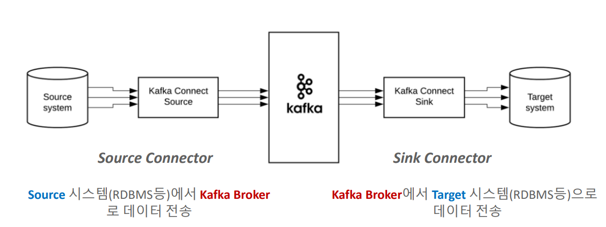

# 카프카 완벽가이드 - 커넥트 편(2편)

```
카프카 완벽가이드 - 커넥트 편(2편)에서는 카프카 커넥트에서 Connector Instance(클래스)들을 로딩하고 호출하는 과정과 Source/Sink Connector를 통한 데이터 전송 과정에 대해 알아본다.
```

## Connector의 유형




### 1. Source Connector

**Source** 시스템(RDBMS 등)에서 **Kafka Broker**로 데이터 전송

**Source Connector**
```
- JDBC(**Source**/Sink) Connector
- Debezium CDC Source Connector (MySQL, Postgresql, Oracle, MongoDB 등)
- File System Source Connector
- MongoDB(**Source**/Sink) Connector
- S3 Source Connector
...
```

### 2. Sink Connector

**Kafka Broker**에서 **Target** 시스템(RDBMS 등)으로 데이터 전송

**Sink Connector**
```
- JDBC(Source/**Sink**) Connector
- Elasticsearch Sink Connector
- Snowflake Sink Connector
- Redshift Sink Connector
- Bigquery Sink Connector
- S3 Sink Connector
...
```

## Spooldir Source Connector

### Spooldir Source Connector

- 특정 디렉토리에 위치한 CSV, Json 포맷 등의 파일들을 Event Message로 만들어서 Kafka로 전송하는 Source Connector
- 해당 디렉토리를 주기적으로 모니터링 수행하면서 새로운 파일이 생성될 때마다 kafka로 메시지 전송

### 환경 구성하기

**TO-DO LIST**

0. connect-distributed.properties에서 plugin.path가 지정되어 있지 않은 경우 plugin.path 잡아주기

1. config 파일 생성
2. Spooldir Source Connector 다운로드 받은 뒤, 압축 풀기 (jcustenborder-kafka-connect-spooldir-2.0.65.zip)
3. Spooldir Source Connector 하위 디렉토리 lib을 plugin.path의 서브 디렉토리로 옮기고 config 파일에서 설정한 디렉토리명으로 변경
4. config 파일에서 설정한 대로 디렉토리 설정 및 파일 준비
5. 모든 준비가 끝났으면 REST API를 이용하여 config 파일을 Connect로 등록하여 신규 Spool Dir Source connector 생성
6. 제대로 동작하는지 Connect log 또는 REST API로 확인
7. Kafka broker에 제대로 전송되었는지 토픽 및 consumer로 확인
8. Source Connector가 Kafka Topic으로 메시지 전송이 완료된 후 원래 파일을 이동시키는 디렉토리에 파일이 있는지 확인

### Spooldir Source Connector 실습

**0. connect-distributed.properties의 plugin.path 설정**

```properties
# **  개별 Connector를 기동을 할 때, 개별 Connector들이 .jar로 되어 있는데,
# Connector가 어디 디렉토리에 있는지 보고, Connect가 .jar를 로딩하고 실행 할 수 있음 **
plugin.path=/home/min/connector_plugins
```

**1. Spooldir Source Connector의 config 파일 만들기**

- spooldir_source.json

```json
{
  "name": "csv_spooldir_source",
  "config": {
    "tasks.max": "1",
    "connector.class": "com.github.jcustenborder.kafka.connect.spooldir.SpoolDirCsvSourceConnector",
    "input.path": "/home/min/spool_test_dir",
    "input.file.pattern": "^.*\\.csv$",
    "error.path": "/home/min/spool_test_dir/error",
    "finished.path": "/home/min/spool_test_dir/finished",
    "empty.poll.wait.ms": 30000,
    "halt.on.error": "false",
    "topic": "spooldir-test-topic",
    "csv.first.row.as.header": "true",
    "schema.generation.enabled": "true"
   }
}
```

**2~3. Spooldir Source Connector lib 디렉토리를 spooldir_source으로 변경하여 plugin.path에 복사** 

```
min@min-VirtualBox:~/connector_plugins$ ls -R
.:
spooldir_source

./spooldir_source:
commons-beanutils-1.9.4.jar         connect-utils-jackson-0.7.173.jar
commons-collections-3.2.2.jar       connect-utils-parser-0.7.173.jar
commons-collections4-4.2.jar        extended-log-format-0.0.2.13.jar
commons-compress-1.22-SNAPSHOT.jar  freemarker-2.3.31.jar
commons-lang3-3.8.1.jar             kafka-connect-spooldir-2.0.65.jar
commons-logging-1.2.jar             opencsv-4.6.jar
commons-text-1.3.jar                value-2.5.5.jar
connect-utils-0.7.173.jar
```

**4. config 파일에서 설정한 대로 디렉토리 설정 및 파일 준비**

```
min@min-VirtualBox:~/spool_test_dir$ pwd
/home/min/spool_test_dir
min@min-VirtualBox:~/spool_test_dir$ ls
csv-spooldir-source.csv  error  finished
```

**5. 모든 준비가 끝났으면 REST API를 이용하여 config 파일을 Connect로 등록하여 신규 Spool Dir Source connector 생성**

```
min@min-VirtualBox:~/connector_configs$ pwd
/home/min/connector_configs

min@min-VirtualBox:~/connector_configs$ ls
spooldir_source.json

min@min-VirtualBox:~/connector_configs$ curl -X POST -H "Content-Type: application/json" http://localhost:8083/connectors --data @spooldir_source.json

{"name":"csv_spooldir_source","config":{"tasks.max":"1","connector.class":"com.github.jcustenborder.kafka.connect.spooldir.SpoolDirCsvSourceConnector","input.path":"/home/min/spool_test_dir","input.file.pattern":"^.*\\.csv$","error.path":"/home/min/spool_test_dir/error","finished.path":"/home/min/spool_test_dir/finished","empty.poll.wait.ms":"30000","halt.on.error":"false","topic":"spooldir-test-topic","csv.first.row.as.header":"true","schema.generation.enabled":"true","name":"csv_spooldir_source"},"tasks":[],"type":"source"}
```

**6. 제대로 동작하는지 Connect log 또는 REST API로 확인**

- REST API 확인

```
min@min-VirtualBox:~/connector_configs$ curl -X GET http://localhost:8083/connectors/csv_spooldir_source/status | jq '.'

  % Total    % Received % Xferd  Average Speed   Time    Time     Time  Current
                                 Dload  Upload   Total   Spent    Left  Speed
100   173  100   173    0     0   7521      0 --:--:-- --:--:-- --:--:--  7521
{
  "name": "csv_spooldir_source",
  "connector": {
    "state": "RUNNING",
    "worker_id": "127.0.1.1:8083"
  },
  "tasks": [
    {
      "id": 0,
      "state": "RUNNING",
      "worker_id": "127.0.1.1:8083"
    }
  ],
  "type": "source"
}
```

- Connect log로 확인
```
2023-12-14 01:22:33,204] INFO [csv_spooldir_source|task-0] SpoolDirCsvSourceConnectorConfig 
values:
        batch.size = 1000
        ...
        empty.poll.wait.ms = 30000
        error.path = /home/min/spool_test_dir/error
        ...
        finished.path = /home/min/spool_test_dir/finished
        ...
        input.file.pattern = ^.*\.csv$
        input.path = /home/min/spool_test_dir
        input.path.walk.recursively = false
        ...
        topic = spooldir-test-topic
        ...
```

7. Kafka broker에 제대로 전송되었는지 토픽 및 consumer로 확인

```
min@min-VirtualBox:~$ cat topicList.sh
/home/min/confluent/bin/kafka-topics --bootstrap-server localhost:9092 --list

min@min-VirtualBox:~$ ./topicList.sh
__consumer_offsets
connect-configs
connect-offsets
connect-status
spooldir-test-topic

min@min-VirtualBox:~/confluent/bin$ ./kafka-console-consumer --bootstrap-server localhost:9092 --topic spooldir-test-topic --from-beginning --property print.key=true

{"schema":{"type":"struct","fields":[],"optional":false,"name":"com.github.jcustenborder.kafka.connect.model.Key"},"payload":{}}        

{"schema":
{"type":"struct",
"fields":[{"type":"string","optional":true,"field":"id"},{"type":"string","optional":true,"field":"first_name"},{"type":"string","optional":true,"field":"last_name"},{"type":"string","optional":true,"field":"email"},{"type":"string","optional":true,"field":"gender"},{"type":"string","optional":true,"field":"ip_address"},{"type":"string","optional":true,"field":"last_login"},{"type":"string","optional":true,"field":"account_balance"},{"type":"string","optional":true,"field":"country"},{"type":"string","optional":true,"field":"favorite_color"}],
"optional":false,"name":"com.github.jcustenborder.kafka.connect.model.Value"},
"payload":{"id":"1000","first_name":"Phineas","last_name":"Frede","email":"pfrederr@weather.com","gender":"Male","ip_address":"59.83.98.78","last_login":"2015-12-04T22:18:07Z","account_balance":"14095.22","country":"PK","favorite_color":"#4f2f2b"}}
```

8. Source Connector가 Kafka Topic으로 메시지 전송이 완료된 후 원래 파일을 이동시키는 디렉토리에 파일이 있는지 확인

```
min@min-VirtualBox:~/spool_test_dir/finished$ pwd
/home/min/spool_test_dir/finished
min@min-VirtualBox:~/spool_test_dir/finished$ ls -R
.:
csv-spooldir-source.csv

./csv-spooldir-source.csv:
csv-spooldir-source.csv
```
