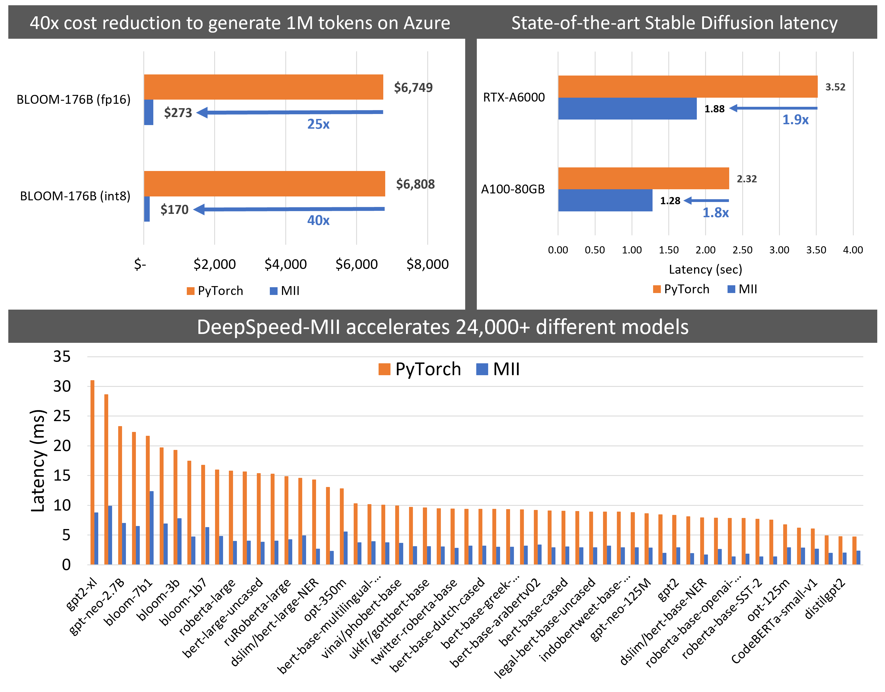

# DeepSpeed & RunPod Search

- 발표자: 윤요섭

- 발표일: 2024-04-12

# 1. Problem Definition

**2024년 04월 04일 오전 sLLM 회의**

1. LLaMa(7B)를 sLLM의 Foundation Model로 선정하여, 학습 및 추론을 진행하고 배포하는 데 있어서, 시간, 비용, 들어가는 리소스를 절약하는 방법 논의

2. DeepSpeed, RunPod Search 

**✔️ 검토사항 중 Serving 관련**

```
1. LLaMa 7B 모델을 학습 및 추론, 배포하는 과정에서 어떻게 훈련에 들어가는 시간과 비용을 낮추고 리소스를 적게 사용하면서 사용할 수 있는지?

2. 모델 연구 환경 구축에 있어서 서버를 직접 구축하지 않고도 훈련 및 추론, 배포가 가능한지? 가능하다면 가격은 어떻게 되는지? 직접 구축하는 것보다 싼지?
```

➡️ DeepSpeed와 RunPod을 공부하여 서치 후, 발표 (2명)

# 2. DeepSpeed Search

## 2-1. What is DeepSpeed?

```
dl training optimization library on the software stack. 
```

모델을 여러 개로 쪼개서 여러 대의 GPU에 업로드 하는 기술을 '모델 병렬화'라고 하는데, 모델 병렬화 기술을 적용하면, 큰 모델도 여러 개의 작은 GPU로 처리할 수 있기 때문에 비용을 낮출 수 있고 속도는 개선할 수 있다.

DeepSpeed는 대표적인 병렬처리 도구로 Megatron LM 기반의 모델 병렬화 기능과 커널 융합을 통한 추론 속도 개선 기능을 제공

- 커널 융합: 여러 개의 GPU 연산을 하나로 합쳐서 연산의 속도를 크게 개선시키는 기술

## 2-2. Why DeepSpeed?

- [참고자료: DeepSpeed | PyTorch Developer Day 2020](https://www.youtube.com/watch?v=ovQC7FqXHXk)

모델의 학습 및 추론 과정에서 5가지 측면에서의 이점이 존재

### 2-2-1. MODEL SCALE


1. nvidia megatron, google t5 -> 10B parameters -> Zero는 연산 및 통신 효율성을 유지하면서 메모리 플로어를 크게 줄임

2. Zero는 Deep Spped가 100B 파라미터 모델을 효율적으로 실행할 수 있도록 함.

3. 17B Turing NLG의 일부 훈련도 수행

5. 3D parallelism의 경우, 1T 파라미터를 가진 모델을 실행할 수 있음.

### 2-2-2. SPEED


1. 25B parameter 이상의 Large Model에 대해 속도 면에서 뛰어남.

2. 기존 병렬 접근 모델과 비교하여 최대 10배 빠른 훈련 속도를 관찰 -> 최대 10배의 비용 절감

### 2-2-3. DEMOCRATIZE AI


1. 웨비나 설문조사 결과, 사용자 절반 이상이 GPU를 1~4개를 가지고 있지만 고급 DL 모델을 탐색하고 이점을 얻기를 희망한다는 것을 알게 됨.

2. 이들을 위해 ZeRO-offload를 릴리즈함 -> 단일 GPU를 가진 머신을 사용하여 대규모 모델을 훈련하는데,CPU와 GPU 메모리를 모두 활용(메모리 부족 문제 없이 최대 13B 모델 실행 가능) -> 기존 방법보다 10배 더 큰 모델을 실행시킬 수 있는 동시에 경쟁력이 있는 처리량을 얻을 수 있었다.

3. 기존의 Adam보다 통신 양을 최대 5배로 줄이면서 유사한 수렴 효율을 달성(이더넷을 사용하는 통신 제약 조건 시나리오에서는 최대 3.5배 빠른 훈련을 관찰하였음) -> 사용자들에게 서로 다른 유형의 GPU 클러스터와 네트워크에서 스케일링하는 기능을 제공 

### 2-2-4. COMPRESSED TRAINING


1. Deep Speed는 리소스를 절약하고 훈련 능력과 효율성을 향상시키기 위해 압축된 훈련을 사용

2. 예시로, Deep Speed Space Attention은 기존 트랜스포머와 비교하여 효율적인 Sparse Kernel을 지원 -> Sparse Kernel은 모델 인풋 시퀀스 길이를 10배까지 지원하고 6배 빠른 훈련을 제공

3. Sparse Kernel은 유연한 스플래시 형식의 효율적인 실행을 지원하며 사용자들이 맞춤형 경로 구조 하에서 혁신할 수 있도록 돕는다.

4. Progressive Layer Drop을 통해, 일부 레이어를 삭제하여 정확도에 지장없이 반복당 훈련 시간 비용을 줄임.

- 참고 자료: [Microsoft Research Blog](https://www.microsoft.com/en-us/research/blog/deepspeed-extreme-scale-model-training-for-everyone/?secret=iSlooB)

### 2-2-5. USABILITY


1. 손쉽게 파이토치의 모델의 코드를 몇 줄만 수정해도 사용할 수 있도록 제공

2. Deep Speed를 통해 사용자들은 모델 병렬성에 대해 걱정하지 않고 데이터 병렬성을 사용하여 최대 13B 파라미터 모델을 훈련할 수 있음. (Deep Speed 없이는 데이터 병렬성만으로는 1.4B 파라미터 모델도 메모리 부족으로 실행되지 않을 것입니다.)

3. 인프라에 독립적이며, 자신이 선호하는 환경에 위젯을 남길 수 있음.

### 2-6. DeepSpeed's four innovation pillars


## 2-3. How to use DeepSpeed?

[Colab 링크 참고](https://colab.research.google.com/drive/10bgmbTl0QYVghkl0kd_OKcxjqSCvjQUa?usp=sharing)

## 2-4. 7Frameworks for Serving LLMs & LLM Inference Landscape

### 2-4-1. 7Frameworks for Serving LLMs Summary

- 참고 자료: [7Frameworks for Serving LLMs](https://betterprogramming.pub/frameworks-for-serving-llms-60b7f7b23407)


- 해당 표는 메모리 용량이 40GB인 단일 A100 GPU를 사용하였고, LLaMA-1 13b 모델로 사용하였음.

- 해당 표에서는 TorchServe, KServe 또는 Triton Inference Server와 같은 딥러닝 모델을 제공하기 위한 기존 라이브러리를 다루지 않았음. (LLM과 함꼐 작동하도록 명시적으로 설계된 프레임워크에만 중점을 두었음)

**Case Study**

```
1. batched prompt delivery에 있어서 최대 속도가 필요하다 -> vLLM

2. HuggingFace support와 core model에 대한 다양한 어댑터를 필요로 하지 않는다 -> Text generation inference

3. CPU에서 추론을 위한 스피드가 중요하다 ->  CTranlate2

4. core model에 대한 어댑터가 필요하고 HuggingFace Agents를 활용한다 -> OpenLLM

5. 안정적인 파이프라인과 유연한 배포 -> Ray Serve

6. Android 혹은 iPhone 플랫폼에서 클라이언트 측에 LLM을 배포 -> MLC LLM

7. DeepSpeed 라이브러리에 대한 경험이 이미 있고 이를 LLM 배포에 계속 사용하겠다 -> DeepSpeed MII
```

- [DeepSpeed MII](https://www.microsoft.com/en-us/research/project/deepspeed/deepspeed-mii/)



```
DeepSpeed-MII는 DeepSpeed로 부터 나온 새로운 오픈소스 파이썬 라이브러리로 실행 가능하고 쉽게 액세스 할 수 있는 강력한 모델에 대한 낮은 대기 시간, 저렴한 비용 추론을 목표로 함.

내부 MII는 DeepSpeed-Inference로 구동
```

### 2-4-1. Compare 7Frameworks for Serving LLMs 

**✔ vLLM**

HuggingFace Transformers보다 14~24배 더 높은 처리량을 달성

HuggingFace Text Generation Inference(TGI)보다 2.2배 ~ 2.5배 더 높은 처리량 달성

연속 일괄 처리로 인해 과도한 쿼리 부하에서도 잘 작동 할 수 있으며, Paged Attention으로 모델 가속화가 가능. 텍스트 생성 속도에서 가장 빠름

사용자 정의 모델 추가 및 어댑터(LoRA, QLoRA 등) 지원 부족, 가중치 양자화의 부재 측면에서 아쉬움이 존재

**✔ Text generation Inference**

텍스트 생성 추론을 위한 Rust, Python, gRPC 서버

내장된 Prometheus 지표로 서버 로드를 모니터링하고 성능에 대한 통찰력을 얻을 수 있음

flash-attention 및 Paged Attention을 사용한 추론을 위해 Optimized transformers code ()

Doocker를 사용하여 웹 서버를 실행하며, 모든 Dependency가 도커 위에서 설치 되고, HuggingFace 모델에 대한 기본 지원이 된다.

어댑터를 사용하여 LLM을 배포할 수 있지만, 이에 대한 공식 지원이나 문서가 없다.

소스(Rust+CUDA 커널)에서 컴파일해야 하는 필요성이 있고, 프로젝트의 README에서 기본 사항은 다루고 있지만, 문제나 소스 코드에서 추가 세부 정보는 검색해야 한다. (Rust 언어를 다루는데 어려움이 있다.)

**✔ CTranslate2**

CPU 및 GPU에서 빠르고 효율적인 실행이 되며, 동적 메모리 사용량으로 인해 메모리 사용량이 요청 크기에 따라 동적으로 변경

다중 CPU 아키텍처를 지원하며, 병렬 및 비동기 실행, 프롬프트 캐싱, 디스크에서 경량화의 장점이 있다.

내장된  REST 서버가 없다 (로깅 및 모니터링 기능 X)

어댑터(LoRA, QLoRA 등)에 대한 지원 부족

**✔ DeepSpeed-MII**

짧은 지연 시간과 높은 처리량의 추론 가능

여러 복제본에 대한 로드 밸런싱과, 업데이트가 대상 환경에 영구적으로 적용되지 않는 접근 방식으로 통제되고 표준화된 환경 구현 가능

Hugging Face, FairSeq 등과 같은 여러 오픈 소스 모델 리포지토리를 통해 사용 가능하며, 지연 시간 정량화 및 비용 절갑이 가능하다.

공식 릴리스 부족 및 제한된 수의 모델, 어댑터(LoRA, QLoRA 등) 지원이 부족하다.

**✔ Open LLM**

운영 환경에서 LLM을 운영하기 위한 개방형 플랫폼으로, 어댑터를 지원하고, Pytorch, Tensorflow와 같은 다양한 구현 사용

HuggingFace에서 다양한 모델을 연결하고 LLM 및 자연어 관리 (HugginFace Agent)

**✔ Ray Serve**

온라인 추론 API를 구축하기 위한 확장 가능한 모델 제공 라이브러리, 딥러닝 모델의 모든 것을 제공

대시보드 및 Prometheus 지표 모니터링 지원 및 여러 복제본에 걸쳐 자동 크기 조정, 동적 요청 일괄 처리가 가능하며

기본 LangChain을 사용하여 원격 Ray Server와 상호작용 가능

기본 제공 모델 최적화 부족(Ray Serve가 LLM에 중점을 두지 않으며 모든 ML 모델을 배포하기 위한 더 광범위한 프레임워크)

높은 진입장벽의 문제

**✔ MLC LLM**

플랫폼 기반 런타임으로, 다양한 플랫폼용 모델을 컴파일 할 수 있음(ios, Android 용 등등)

어댑터 지원은 없으며, 복잡한 설치가 단점

**✔️ LLM Inference Landscape**

- 참고 자료 : [Enabling Cost-Efficient LLM Serving with Ray Serve](https://www.youtube.com/watch?v=TJ5K1CO9Wbs)


# 3. RunPod Search

RunPod은 인공지능 추론과 훈련을 위한 전 세계적으로 분산된 클라우드 플랫폼

- GPU 인스턴스를 제공
- TensorFlow 및 Pytorch와 같은 인기있는 프레임 워크를 지원하며 AI작업을 쉽게 실행할 수 있음

## 3-1. RunPod의 핵심 기능


## 3-2. How to use RunPod

### 3-2-1. [RunPod 환경구성](https://www.runpod.io/console/deploy)

Instance 구성 시, 시간 당 비용으로 선택하여 구성 할 수 있음.

**✔️ Secure Cloud 시간당 비용**


**✔️ Community Cloud 시간당 비용**


Secure Cloud가 Community Cloud에 비해 가격이 높게 측정 되어 있는 것을 확인 할 수 있다.

구성하려고 할 때마다, 가능한 설정과 그렇지 않은 설정 옵션들이 표시된다.

**✔️ Data Center**

Data Center의 경우, 캐나다, 유럽, 미국 중 선택할 수 있다.

**✔️ Environment Setting**

```
GPU: NVIDIA 1 x A100 80GB

GPU Count: 1

Instance Pricing: On-Demand(Start Jupyter Notebook)
```

Pricing Summary

```
GPU Cost: $1.89 / hr
```

### 3-2-2. RunPod Connect & Test

Pod이 만들어지면 Connection Option을 통해 접속할 수 있음


**✔️[RunPod 실습: SQL Generation in Text2SQL with TinyLlama's LLM Fine-tuning (analyticsvidhya.com)](https://www.analyticsvidhya.com/blog/2024/02/sql-generation-in-text2sql-with-tinyllamas-llm-fine-tuning/)**

[RunPod에서 실습했던 ipynb](https://colab.research.google.com/drive/1boAlK8EobsatJ95Rp-6UHp7m2iJq5QDX?usp=sharing)


- Colab에서의 T4 GPU와는 다른 환경으로 구성된 것을 확인

사용량이 아니라 시간당으로 계산하는 방식이라는 것과 Pod에 대한 메모리나 디스크 사용 등을 모니터링 할 수 있는 것이 장점

그러나, 환경 세팅이 접속때마다 가능한 GPU가 있고 없고 달라진다는 단점도 있음


# 4. To Do ...

## 4-1. 모델 학습 및 서빙 최적화 프로세스 구성 및 성능 벤치마킹
- [DeepSpeed config 구성에 있어 옵션별 특징 정리](https://yscho03.tistory.com/281)

- DeepSpeed를 활용했을 때, 추론 속도 측면에서 얼마나 효과가 있었는지 실험하기
- Zero Paper를 통해 어떻게 속도를 높였고, 자원을 덜 사용할 수 있었는지 탐색하기

- [Parallelformers 블로그](https://tunib.tistory.com/entry/Parallelformers-%EB%B9%85%EB%AA%A8%EB%8D%B8-%EB%B0%B0%ED%8F%AC%EB%A5%BC-%ED%96%A5%ED%95%9C-%EC%97%AC%EC%A0%95%ED%8A%9C%EB%8B%99)에서 모델의 웹서버 배포 불가능 문제, 모델이 반드시 GPU에 업로드 되어 있는 상태에서 병렬화를 시작해야 하는 문제 체크

## 4-1. 모델 학습 및 서빙 최적화 프로세스 구성
- 사용하고자 하는 모델을 통한 학습과 타 프레임워크와 비교하여 서빙에 최적화 되어있는지 체크

## 4-2. 성능 벤치마킹
- DeepSpeed를 사용하였을 때, 성능이 뛰어난지 등에 대한 실험