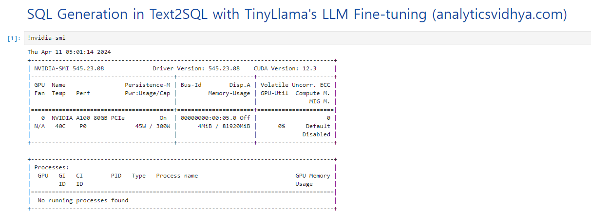

# DeepSpeed & RunPod Search

- 발표자: 윤요섭

- 발표일: 2024-04-11

# 1. Problem Definition

**2024년 04월 04일 오전 sLLM 회의**

1. LLaMa(7B)를 sLLM의 Foundation Model로 선정하여, 학습 및 추론을 진행하고 배포하는 데 있어서, 시간, 비용, 들어가는 리소스를 절약하는 방법 논의

2. DeepSpeed, RunPod Search 

**✔️ 검토사항 중 Serving 관련**

```
1. LLaMa 7B 모델을 학습 및 추론, 배포하는 과정에서 어떻게 훈련에 들어가는 시간과 비용을 낮추고 리소스를 적게 사용하면서 사용할 수 있는지?

2. 모델 연구 환경 구축에 있어서 서버를 직접 구축하지 않고도 훈련 및 추론, 배포가 가능한지? 가능하다면 가격은 어떻게 되는지? 직접 구축하는 것보다 싼지?
```

➡️ DeepSpeed와 RunPod을 공부하여 서치 후, 발표 (2명)

# 2. DeepSpeed Search

## 2-1. What is DeepSpeed?

```
dl training optimization library on the software stack. 
```

## 2-2. Why DeepSpeed?

- [참고자료: DeepSpeed | PyTorch Developer Day 2020](https://www.youtube.com/watch?v=ovQC7FqXHXk)

모델의 학습 및 추론 과정에서 5가지 측면에서의 이점이 존재

### 2-2-1. MODEL SCALE


1. nvidia megatron, google t5 -> 10B parameters -> Zero는 연산 및 통신 효율성을 유지하면서 메모리 플로어를 크게 줄임

2. Zero는 Deep Spped가 100B 파라미터 모델을 효율적으로 실행할 수 있도록 함.

3. 17B Turing NLG의 일부 훈련도 수행

5. 3D parallelism의 경우, 1T 파라미터를 가진 모델을 실행할 수 있음.

### 2-2-2. SPEED


1. 25B parameter 이상의 Large Model에 대해 속도 면에서 뛰어남.

2. 기존 병렬 접근 모델과 비교하여 최대 10배 빠른 훈련 속도를 관찰 -> 최대 10배의 비용 절감

### 2-2-3. DEMOCRATIZE AI


1. 웨비나 설문조사 결과, 사용자 절반 이상이 GPU를 1~4개를 가지고 있지만 고급 DL 모델을 탐색하고 이점을 얻기를 희망한다는 것을 알게 됨.

2. 이들을 위해 ZeRO-offload를 릴리즈함 -> 단일 GPU를 가진 머신을 사용하여 대규모 모델을 훈련하는데,CPU와 GPU 메모리를 모두 활용(메모리 부족 문제 없이 최대 13B 모델 실행 가능) -> 기존 방법보다 10배 더 큰 모델을 실행시킬 수 있는 동시에 경쟁력이 있는 처리량을 얻을 수 있었다.

3. 기존의 Adam보다 통신 양을 최대 5배로 줄이면서 유사한 수렴 효율을 달성(이더넷을 사용하는 통신 제약 조건 시나리오에서는 최대 3.5배 빠른 훈련을 관찰하였음) -> 사용자들에게 서로 다른 유형의 GPU 클러스터와 네트워크에서 스케일링하는 기능을 제공 

### 2-2-4. COMPRESSED TRAINING


1. Deep Speed는 리소스를 절약하고 훈련 능력과 효율성을 향상시키기 위해 압축된 훈련을 사용

2. 예시로, Deep Speed Space Attention은 기존 트랜스포머와 비교하여 효율적인 Sparse Kernel을 지원 -> Sparse Kernel은 모델 인풋 시퀀스 길이를 10배까지 지원하고 6배 빠른 훈련을 제공

3. Sparse Kernel은 유연한 스플래시 형식의 효율적인 실행을 지원하며 사용자들이 맞춤형 경로 구조 하에서 혁신할 수 있도록 돕는다.

4. Progressive Layer Drop을 통해, 일부 레이어를 삭제하여 정확도에 지장없이 반복당 훈련 시간 비용을 줄임.

- 참고 자료: [Microsoft Research Blog](https://www.microsoft.com/en-us/research/blog/deepspeed-extreme-scale-model-training-for-everyone/?secret=iSlooB)

### 2-2-5. USABILITY


1. 손쉽게 파이토치의 모델의 코드를 몇 줄만 수정해도 사용할 수 있도록 제공

2. Deep Speed를 통해 사용자들은 모델 병렬성에 대해 걱정하지 않고 데이터 병렬성을 사용하여 최대 13B 파라미터 모델을 훈련할 수 있음. (Deep Speed 없이는 데이터 병렬성만으로는 1.4B 파라미터 모델도 메모리 부족으로 실행되지 않을 것입니다.)

3. 인프라에 독립적이며, 자신이 선호하는 환경에 위젯을 남길 수 있음.

### 2-6. DeepSpeed's four innovation pillars


## 2-3. How to use DeepSpeed?

[Colab 링크 참고](https://colab.research.google.com/drive/10bgmbTl0QYVghkl0kd_OKcxjqSCvjQUa?usp=sharing)

## 2-4. 7Frameworks for Serving LLMs & LLM Inference Landscape

**✔️ 7Frameworks for Serving LLMs**

- 참고 자료: [7Frameworks for Serving LLMs](https://betterprogramming.pub/frameworks-for-serving-llms-60b7f7b23407)


**✔️ LLM Inference Landscape**

- 참고 자료 : [Enabling Cost-Efficient LLM Serving with Ray Serve](https://www.youtube.com/watch?v=TJ5K1CO9Wbs)


✔️ **Search Conclusion**

```
1. LLaMa 7B 모델을 학습 및 추론, 배포하는 과정에서 DeepSpeed를 통해 훈련에 들어가는 시간과 비용을 낮추고 리소스를 적게 사용하면서 사용할 수 있는지?
```

➡️ Latency만 본다면, 타 프레임워크에 비해 뛰어나다고 볼 수 있습니다. 그러나, 타 프레임워크에서는 지원하지만 DeepSpeed에서는 지원하지 않는 기능이 필요하지 않은 기능인지 필요하다면 어떻게 구현할 것인지 검토할 필요는 있어 보입니다.


# 3. RunPod Search

RunPod은 인공지능 추론과 훈련을 위한 전 세계적으로 분산된 클라우드 플랫폼

- GPU 인스턴스를 제공
- TensorFlow 및 Pytorch와 같은 인기있는 프레임 워크를 지원하며 AI작업을 쉽게 실행할 수 있음

## 3-1. RunPod의 핵심 기능


## 3-2. How to use RunPod

### 3-2-1. [RunPod 환경구성](https://www.runpod.io/console/deploy)

Instance 구성 시, 시간 당 비용으로 선택하여 구성 할 수 있음.

**✔️ Secure Cloud 시간당 비용**


**✔️ Community Cloud 시간당 비용**


Secure Cloud가 Community Cloud에 비해 가격이 높게 측정 되어 있는 것을 확인 할 수 있다.

구성하려고 할 때마다, 가능한 설정과 그렇지 않은 설정 옵션들이 표시된다.

**✔️ Data Center**

Data Center의 경우, 캐나다, 유럽, 미국 중 선택할 수 있다.

**✔️ Environment Setting**

```
GPU: NVIDIA 1 x A100 80GB

GPU Count: 1

Instance Pricing: On-Demand(Start Jupyter Notebook)
```

Pricing Summary

```
GPU Cost: $1.89 / hr
```

### 3-2-2. RunPod Connect & Test

Pod이 만들어지면 Connection Option을 통해 접속할 수 있음


**✔️[RunPod 실습: SQL Generation in Text2SQL with TinyLlama's LLM Fine-tuning (analyticsvidhya.com)](https://www.analyticsvidhya.com/blog/2024/02/sql-generation-in-text2sql-with-tinyllamas-llm-fine-tuning/)**

[RunPod에서 실습했던 ipynb](https://colab.research.google.com/drive/1boAlK8EobsatJ95Rp-6UHp7m2iJq5QDX?usp=sharing)



- Colab에서의 T4 GPU와는 다른 환경으로 구성된 것을 확인

사용량이 아니라 시간당으로 계산하는 방식이라는 것과 Pod에 대한 메모리나 디스크 사용 등을 모니터링 할 수 있는 것이 장점

그러나, 환경 세팅이 접속때마다 가능한 GPU가 있고 없고 달라진다는 단점도 있음

```
To Do ...
# 4. 모델 학습 및 서빙 최적화 프로세스 구성 및 성능 벤치마킹

## 4-1. 모델 학습 및 서빙 최적화 프로세스 구성

## 4-2. 성능 벤치마킹
```